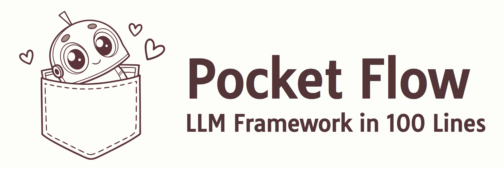
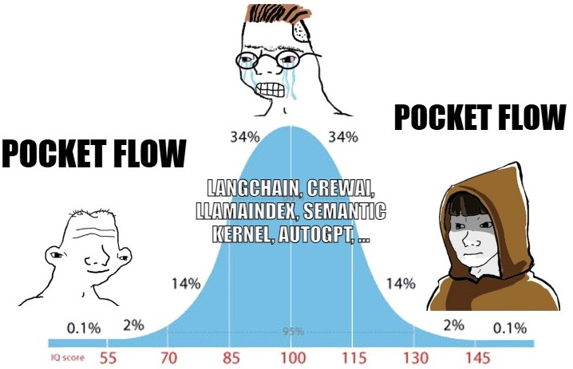
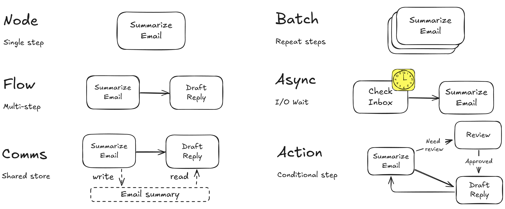
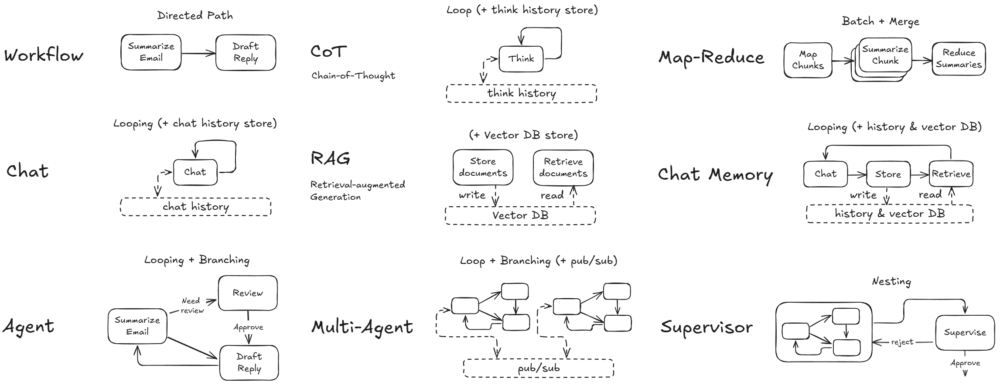

<div align="center">
  
</div>


[](https://the-pocket.github.io/PocketFlow/)
 <a href="https://discord.gg/hUHHE9Sa6T">
    
</a>

Pocket Flow is a [100-line](pocketflow/__init__.py) minimalist LLM framework

- **Lightweight**: Just 100 lines. Zero bloat, zero dependencies, zero vendor lock-in.
  
- **Expressive**: Everything you love—([Multi-](https://the-pocket.github.io/PocketFlow/design_pattern/multi_agent.html))[Agents](https://the-pocket.github.io/PocketFlow/design_pattern/agent.html), [Workflow](https://the-pocket.github.io/PocketFlow/design_pattern/workflow.html), [RAG](https://the-pocket.github.io/PocketFlow/design_pattern/rag.html), and more.

- **Agentic Coding**: Let AI Agents (e.g., Cursor AI) build Agents—10x productivity boost!

- To install, ```pip install pocketflow```or just copy the [source code](pocketflow/__init__.py) (only 100 lines).
  
- To learn more, check out the [documentation](https://the-pocket.github.io/PocketFlow/). For an in-depth design dive, read the [essay](https://github.com/The-Pocket/.github/blob/main/profile/pocketflow.md).
  
- 🎉 We now have a [discord](https://discord.gg/hUHHE9Sa6T)!

## Why Pocket Flow?

Current LLM frameworks are bloated... You only need 100 lines for LLM Framework!

<div align="center">
  


  |                | **Abstraction**          | **App-Specific Wrappers**                                      | **Vendor-Specific Wrappers**                                    | **Lines**       | **Size**    |
|----------------|:-----------------------------: |:-----------------------------------------------------------:|:------------------------------------------------------------:|:---------------:|:----------------------------:|
| LangChain  | Agent, Chain               | Many <br><sup><sub>(e.g., QA, Summarization)</sub></sup>              | Many <br><sup><sub>(e.g., OpenAI, Pinecone, etc.)</sub></sup>                   | 405K          | +166MB                     |
| CrewAI     | Agent, Chain            | Many <br><sup><sub>(e.g., FileReadTool, SerperDevTool)</sub></sup>         | Many <br><sup><sub>(e.g., OpenAI, Anthropic, Pinecone, etc.)</sub></sup>        | 18K           | +173MB                     |
| SmolAgent   | Agent                      | Some <br><sup><sub>(e.g., CodeAgent, VisitWebTool)</sub></sup>         | Some <br><sup><sub>(e.g., DuckDuckGo, Hugging Face, etc.)</sub></sup>           | 8K            | +198MB                     |
| LangGraph   | Agent, Graph           | Some <br><sup><sub>(e.g., Semantic Search)</sub></sup>                     | Some <br><sup><sub>(e.g., PostgresStore, SqliteSaver, etc.) </sub></sup>        | 37K           | +51MB                      |
| AutoGen    | Agent                | Some <br><sup><sub>(e.g., Tool Agent, Chat Agent)</sub></sup>              | Many <sup><sub>[Optional]<br> (e.g., OpenAI, Pinecone, etc.)</sub></sup>        | 7K <br><sup><sub>(core-only)</sub></sup>    | +26MB <br><sup><sub>(core-only)</sub></sup>          |
| **PocketFlow** | **Graph**                    | **None**                                                 | **None**                                                  | **100**       | **+56KB**                  |

</div>

**Pocket Flow** is also a educational resource for understanding LLM frameworks:

- Larger frameworks are overly abstract and hide away details.

- **Pocket Flow** shows exactly how everything works under the hood.

## How to Use Pocket Flow?

🚀 Through **Agent Coding**—the fastest LLM App development paradigm-where humans design and agents code!

<br>
<div align="center">
  <a href="https://youtu.be/Cf38Bi8U0Js" target="_blank">
    
  </a>
</div>
<br>


✨ Below are examples of LLM Apps:

<div align="center">
  
|  App Name     |  Difficulty    | Topics  | Human Design | Agent Code |
| :-------------:  | :-------------: | :---------------------: |  :---: |  :---: |
| [Build Cursor with Cursor](https://github.com/The-Pocket/Tutorial-Cursor) <br> <sup><sub>We’ll reach the singularity soon ...</sup></sub> | ★★★ <br> *Advanced*   | [Agent](https://the-pocket.github.io/PocketFlow/design_pattern/agent.html) | [Design Doc](https://github.com/The-Pocket/Tutorial-Cursor/blob/main/docs/design.md) | [Flow Code](https://github.com/The-Pocket/Tutorial-Cursor/blob/main/flow.py)
| [Ask AI Paul Graham](https://github.com/The-Pocket/Tutorial-YC-Partner) <br> <sup><sub>Ask AI Paul Graham, in case you don't get in</sup></sub> | ★★☆ <br> *Medium*   | [RAG](https://the-pocket.github.io/PocketFlow/design_pattern/rag.html) <br> [Map Reduce](https://the-pocket.github.io/PocketFlow/design_pattern/mapreduce.html) <br> [TTS](https://the-pocket.github.io/PocketFlow/utility_function/text_to_speech.html) | [Design Doc](https://github.com/The-Pocket/Tutorial-AI-Paul-Graham/blob/main/docs/design.md) | [Flow Code](https://github.com/The-Pocket/Tutorial-AI-Paul-Graham/blob/main/flow.py)
| [Youtube Summarizer](https://github.com/The-Pocket/Tutorial-Youtube-Made-Simple)  <br> <sup><sub> Explain YouTube Videos to you like you're 5 </sup></sub> | ★☆☆ <br> *Beginner*   | [Map Reduce](https://the-pocket.github.io/PocketFlow/design_pattern/mapreduce.html) |  [Design Doc](https://github.com/The-Pocket/Tutorial-Youtube-Made-Simple/blob/main/docs/design.md) | [Flow Code](https://github.com/The-Pocket/Tutorial-Youtube-Made-Simple/blob/main/flow.py)
| [Cold Opener Generator](https://github.com/The-Pocket/Tutorial-Cold-Email-Personalization)  <br> <sup><sub> Instant icebreakers that turn cold leads hot </sup></sub> | ★☆☆ <br> *Beginner*   | [Map Reduce](https://the-pocket.github.io/PocketFlow/design_pattern/mapreduce.html) <br> [Web Search](https://the-pocket.github.io/PocketFlow/utility_function/websearch.html) |  [Design Doc](https://github.com/The-Pocket/Tutorial-Cold-Email-Personalization/blob/master/docs/design.md) | [Flow Code](https://github.com/The-Pocket/Tutorial-Cold-Email-Personalization/blob/master/flow.py)

</div>

- Want to learn **Agent Coding**? Check out [my YouTube](https://www.youtube.com/@ZacharyLLM?sub_confirmation=1)! Read this [Guide](https://the-pocket.github.io/PocketFlow/guide.html)!
  
- Want to build your own LLM App? Start with [this template](https://github.com/The-Pocket/PocketFlow-Template-Python)!


## How does Pocket Flow work?

The [100 lines](pocketflow/__init__.py) capture the core abstraction of LLM frameworks: Graph!

<div align="center">
  
</div>

From there, it’s easy to implement popular design patterns like ([Multi-](https://the-pocket.github.io/PocketFlow/design_pattern/multi_agent.html))[Agents](https://the-pocket.github.io/PocketFlow/design_pattern/agent.html), [Workflow](https://the-pocket.github.io/PocketFlow/design_pattern/workflow.html), [RAG](https://the-pocket.github.io/PocketFlow/design_pattern/rag.html), etc.

<div align="center">
  
</div>


