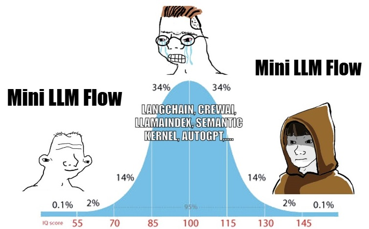
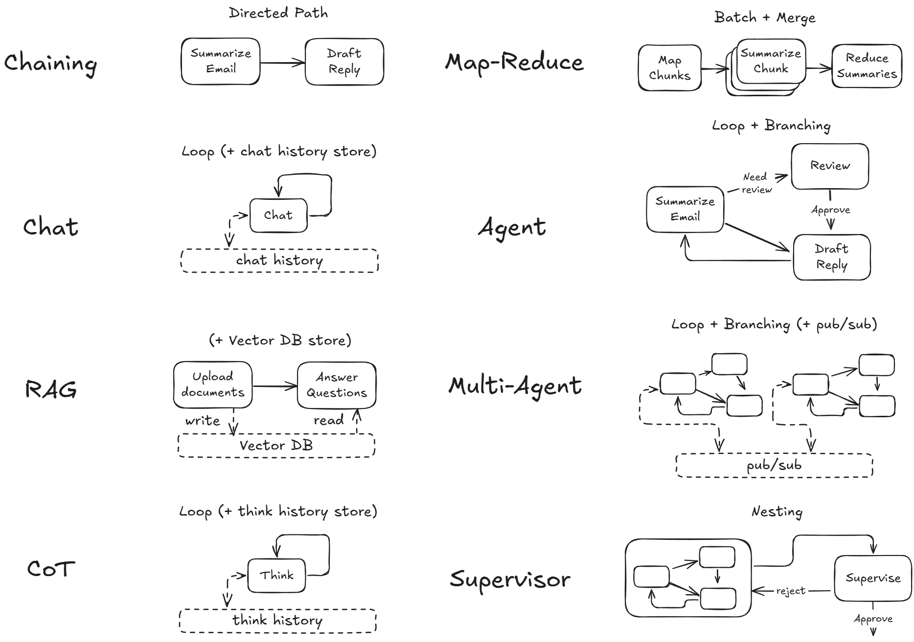

<h1 align="center">Pocket Flow - LLM Framework in 100 Lines</h1>


[](https://the-pocket.github.io/PocketFlow/)

<div align="center">
  
</div>

<br>

A [100-line](pocketflow/__init__.py) minimalist LLM framework for ([Multi-](https://the-pocket.github.io/PocketFlow/multi_agent.html))[Agents](https://the-pocket.github.io/PocketFlow/agent.html), [Workflow](https://the-pocket.github.io/PocketFlow/decomp.html), [RAG](https://the-pocket.github.io/PocketFlow/rag.html), etc.

- Install via  ```pip install pocketflow```, or just copy the [source code](pocketflow/__init__.py) (only 100 lines).

- If the 100 lines are too terse, check out a [friendlier intro](https://chatgpt.com/share/678564bd-1ba4-8000-98e4-a6ffe363c1b8).

- Documentation: https://the-pocket.github.io/PocketFlow/

## Why only 100 lines?

Pocket Flow is for a new development paradigmn: 

> **Build LLM apps Simply by Chatting with LLM agents** —no need for *any* manual coding!

1. 📝 You **describe your app requirements** in conversation or a design doc.
2. 🤖 The agent (like Cursor AI) **writes and refines** your code automatically.
3. 💬 You **stay in the loop** just by chatting—*never* by writing boilerplate code or wrestling with complex libraries.

<br>
<div align="center">
  <a href="https://youtu.be/0Pv5HVoVBYE" target="_blank">
    
  </a>
</div>
<br>


**Compared to other frameworks**, Pocket Flow is *purpose-built for LLM Agents*:

1. **🫠 LangChain-like frameworks** overwhelm Cursor AI with complex and outdated abstractions.
2. 😐  Ironically, **No Framework** is better as it yields  *functional* code—but it ends up ad hoc, one-shot, and hard to maintaina.
3. **🥰 With Pocket Flow**: (1) Minimal and expressive—easy for Cursor AI. (2) **Nodes and Flows** keep everything *modular and organized*. (3) A **Shared Store** decouples your data structure from compute logic.

In short, the **100 lines** ensures Cursor AI follows solid coding practices without sacrificing flexibility. To start:

  - **[Cursor Rules](https://docs.cursor.com/context/rules-for-ai)**: Copy [.cursorrules](assets/.cursorrules) into your project’s root.

  - **ChatGPT & Claude**: Create a project ([ChatGPT](https://help.openai.com/en/articles/10169521-using-projects-in-chatgpt) and[Claude](https://www.anthropic.com/news/projects)) and upload the [docs](docs) folder to project knowledge.
  

## How the 100 lines work?

The [100 lines](pocketflow/__init__.py) capture what we believe to be the core abstraction of LLM projects:
 - **Computation**: A *graph* that breaks down tasks into nodes, with *branching, looping,  and nesting*.
 - **Communication**: A *shared store* that all nodes can read and write to.

<br>
<div align="center">
  
</div>
<br>

From there, it’s easy to implement popular design patterns like ([Multi-](https://the-pocket.github.io/PocketFlow/multi_agent.html))[Agents](https://the-pocket.github.io/PocketFlow/agent.html), [Workflow](https://the-pocket.github.io/PocketFlow/decomp.html), [RAG](https://the-pocket.github.io/PocketFlow/rag.html), etc.

<br>
<div align="center">
  
</div>
<br>

- To learn more about how it works, check out the [documentation](https://the-pocket.github.io/PocketFlow/)
- For an in-depth dive into the design, check out the [essay](https://github.com/The-Pocket/.github/blob/main/profile/pocketflow.md)

