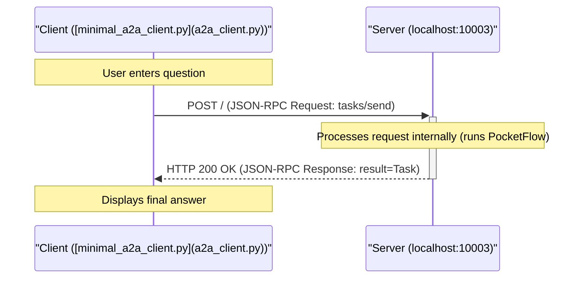

# PocketFlow Agent with A2A Protocol

This project demonstrates how to take an existing agent built with the PocketFlow library and make it accessible to other agents using the **Agent-to-Agent (A2A) communication protocol**.

This implementation is based  on the tutorial: [A2A Protocol Simply Explained: Here are 3 key differences to MCP!](https://zacharyhuang.substack.com/p/a2a-protocol-simply-explained-here)

## How it Works: A2A Integration

This project combines two main parts:

1.  **PocketFlow Agent Logic:** The original agent code ([`nodes.py`](nodes.py), [`utils.py`](utils.py), [`flow.py`](flow.py)) defines the internal workflow (Decide -> Search -> Answer). This code is taken directly from the [PocketFlow Agent Tutorial](https://github.com/The-Pocket/PocketFlow/tree/main/cookbook/pocketflow-agent).
2.  **A2A Server Wrapper:** Code from the [google/A2A samples repository](https://github.com/google/A2A/tree/main/samples/python) (`common/` directory) provides the necessary infrastructure to host the agent as an A2A-compliant server. *Note: Minor modifications were made to the common server/client code to add detailed logging for educational purposes.*
3.  **The Bridge ([`task_manager.py`](task_manager.py)):** A custom `PocketFlowTaskManager` class acts as the bridge. It receives A2A requests (like `tasks/send`), extracts the user query, runs the PocketFlow `agent_flow`, takes the final result from the flow's shared state, and packages it back into an A2A `Task` object with the answer as an `Artifact`.

This demonstrates how a non-A2A agent framework can be exposed over the A2A protocol by implementing a specific `TaskManager`.

## Simplified Interaction Sequence



## Getting Started

### Prerequisites

*   Python 3.10+ (due to type hinting used in the A2A `common` code)
*   An OpenAI API Key

### Installation


1.  Install dependencies:
    ```bash
    pip install -r requirements.txt
    ```

2. Set your OpenAI API key as an environment variable:

    ```bash
    export OPENAI_API_KEY="your-api-key-here"
    ```

    Let's do a quick check to make sure your API key is working properly:

    ```bash
    python utils.py
    ```
3. Run the server from this directory:

    ```bash
    python a2a_server.py --port 10003
    ```

    You should see logs indicating the server has started on `http://localhost:10003`.


4.  Run the Client in a *separate terminal* 

    ```bash
    python a2a_client.py --agent-url http://localhost:10003
    ```

5.  Follow the instructions in the client terminal to ask questions. Type `:q` or `quit` to exit the client.

## Example Interaction Logs

**(Server Log - showing internal PocketFlow steps)**

```
2025-04-12 17:20:40,893 - __main__ - INFO - Starting PocketFlow A2A server on http://localhost:10003
INFO:     Started server process [677223]
INFO:     Waiting for application startup.
INFO:     Application startup complete.
INFO:     Uvicorn running on http://localhost:10003 (Press CTRL+C to quit)
2025-04-12 17:20:57,647 - A2AServer - INFO - <- Received Request (ID: d3f3fb93350d47d9a94ca12bb62b656b):
{
  "jsonrpc": "2.0",
  "id": "d3f3fb93350d47d9a94ca12bb62b656b",
  "method": "tasks/send",
  "params": {
    "id": "46c3ce7b941a4fff9b8e3b644d6db5f4",
    "sessionId": "f3e12b8424c44241be881cd4bb8a269f",
    "message": {
      "role": "user",
      "parts": [
        {
          "type": "text",
          "text": "Who won the Nobel Prize in Physics 2024?"
        }
      ]
    },
    "acceptedOutputModes": [
      "text",
      "text/plain"
    ]
  }
}
2025-04-12 17:20:57,647 - task_manager - INFO - Received task send request: 46c3ce7b941a4fff9b8e3b644d6db5f4
2025-04-12 17:20:57,647 - common.server.task_manager - INFO - Upserting task 46c3ce7b941a4fff9b8e3b644d6db5f4
2025-04-12 17:20:57,647 - task_manager - INFO - Running PocketFlow for task 46c3ce7b941a4fff9b8e3b644d6db5f4...
🤔 Agent deciding what to do next...
2025-04-12 17:20:59,213 - httpx - INFO - HTTP Request: POST https://api.openai.com/v1/chat/completions "HTTP/1.1 200 OK"
🔍 Agent decided to search for: 2024 Nobel Prize in Physics winner
🌐 Searching the web for: 2024 Nobel Prize in Physics winner
2025-04-12 17:20:59,974 - primp - INFO - response: https://lite.duckduckgo.com/lite/ 200
📚 Found information, analyzing results...
🤔 Agent deciding what to do next...
2025-04-12 17:21:01,619 - httpx - INFO - HTTP Request: POST https://api.openai.com/v1/chat/completions "HTTP/1.1 200 OK"
💡 Agent decided to answer the question
✍️ Crafting final answer...
2025-04-12 17:21:03,833 - httpx - INFO - HTTP Request: POST https://api.openai.com/v1/chat/completions "HTTP/1.1 200 OK"
✅ Answer generated successfully
2025-04-12 17:21:03,834 - task_manager - INFO - PocketFlow completed for task 46c3ce7b941a4fff9b8e3b644d6db5f4
2025-04-12 17:21:03,834 - A2AServer - INFO - -> Response (ID: d3f3fb93350d47d9a94ca12bb62b656b):
{
  "jsonrpc": "2.0",
  "id": "d3f3fb93350d47d9a94ca12bb62b656b",
  "result": {
    "id": "46c3ce7b941a4fff9b8e3b644d6db5f4",
    "sessionId": "f3e12b8424c44241be881cd4bb8a269f",
    "status": {
      "state": "completed",
      "timestamp": "2025-04-12T17:21:03.834542"
    },
    "artifacts": [
      {
        "parts": [
          {
            "type": "text",
            "text": "The 2024 Nobel Prize in Physics was awarded to John J. Hopfield and Geoffrey Hinton for their foundational discoveries and inventions that have significantly advanced the field of machine learning through the use of artificial neural networks. Their pioneering work has been crucial in the development and implementation of algorithms that enable machines to learn and process information in a manner that mimics human cognitive functions. This advancement in artificial intelligence technology has had a profound impact on numerous industries, facilitating innovations across various applications, from image and speech recognition to self-driving cars."
          }
        ],
        "index": 0
      }
    ],
    "history": []
  }
}
```

**(Client Log - showing request/response)**

```
Connecting to agent at: http://localhost:10003
Using Session ID: f3e12b8424c44241be881cd4bb8a269f

Enter your question (:q or quit to exit) > Who won the Nobel Prize in Physics 2024?
Sending task 46c3ce7b941a4fff9b8e3b644d6db5f4...
2025-04-12 17:20:57,643 - A2AClient - INFO - -> Sending Request (ID: d3f3fb93350d47d9a94ca12bb62b656b, Method: tasks/send):
{
  "jsonrpc": "2.0",
  "id": "d3f3fb93350d47d9a94ca12bb62b656b",
  "method": "tasks/send",
  "params": {
    "id": "46c3ce7b941a4fff9b8e3b644d6db5f4",
    "sessionId": "f3e12b8424c44241be881cd4bb8a269f",
    "message": {
      "role": "user",
      "parts": [
        {
          "type": "text",
          "text": "Who won the Nobel Prize in Physics 2024?"
        }
      ]
    },
    "acceptedOutputModes": [
      "text",
      "text/plain"
    ]
  }
}
2025-04-12 17:21:03,835 - httpx - INFO - HTTP Request: POST http://localhost:10003 "HTTP/1.1 200 OK"
2025-04-12 17:21:03,836 - A2AClient - INFO - <- Received HTTP Status 200 for Request (ID: d3f3fb93350d47d9a94ca12bb62b656b)
2025-04-12 17:21:03,836 - A2AClient - INFO - <- Received Success Response (ID: d3f3fb93350d47d9a94ca12bb62b656b):
{
  "jsonrpc": "2.0",
  "id": "d3f3fb93350d47d9a94ca12bb62b656b",
  "result": {
    "id": "46c3ce7b941a4fff9b8e3b644d6db5f4",
    "sessionId": "f3e12b8424c44241be881cd4bb8a269f",
    "status": {
      "state": "completed",
      "timestamp": "2025-04-12T17:21:03.834542"
    },
    "artifacts": [
      {
        "parts": [
          {
            "type": "text",
            "text": "The 2024 Nobel Prize in Physics was awarded to John J. Hopfield and Geoffrey Hinton for their foundational discoveries and inventions that have significantly advanced the field of machine learning through the use of artificial neural networks. Their pioneering work has been crucial in the development and implementation of algorithms that enable machines to learn and process information in a manner that mimics human cognitive functions. This advancement in artificial intelligence technology has had a profound impact on numerous industries, facilitating innovations across various applications, from image and speech recognition to self-driving cars."
          }
        ],
        "index": 0
      }
    ],
    "history": []
  }
}
Task 46c3ce7b941a4fff9b8e3b644d6db5f4 finished with state: completed

Agent Response:
The 2024 Nobel Prize in Physics was awarded to John J. Hopfield and Geoffrey Hinton for their foundational discoveries and inventions that have significantly advanced the field of machine learning through the use of artificial neural networks. Their pioneering work has been crucial in the development and implementation of algorithms that enable machines to learn and process information in a manner that mimics human cognitive functions. This advancement in artificial intelligence technology has had a profound impact on numerous industries, facilitating innovations across various applications, from image and speech recognition to self-driving cars.
```

## Key A2A Integration Points

To make the PocketFlow agent A2A-compatible, the following were essential:

1.  **A2A Server ([`common/server/server.py`](common/server/server.py)):** An ASGI application (using Starlette/Uvicorn) that listens for HTTP POST requests, parses JSON-RPC, and routes requests based on the `method` field.
2.  **A2A Data Types ([`common/types.py`](common/types.py)):** Pydantic models defining the structure of A2A messages, tasks, artifacts, errors, and the agent card, ensuring compliance with the `a2a.json` specification.
3.  **Task Manager ([`task_manager.py`](task_manager.py)):** A custom class (`PocketFlowTaskManager`) inheriting from the common `InMemoryTaskManager`. Its primary role is implementing the `on_send_task` method (and potentially others like `on_send_task_subscribe` if streaming were supported). This method:
    *   Receives the validated A2A `SendTaskRequest`.
    *   Extracts the user's query (`TextPart`) from the request's `message`.
    *   Initializes the PocketFlow `shared_data` dictionary.
    *   Creates and runs the PocketFlow `agent_flow`.
    *   Retrieves the final answer from the `shared_data` dictionary *after* the flow completes.
    *   Updates the task's state (e.g., to `COMPLETED` or `FAILED`) in the `InMemoryTaskManager`'s store.
    *   Packages the final answer into an A2A `Artifact` containing a `TextPart`.
    *   Constructs the final A2A `Task` object for the response.
4.  **Agent Card ([`a2a_server.py`](a2a_server.py)):** A Pydantic model (`AgentCard`) defining the agent's metadata (name, description, URL, capabilities, skills) served at `/.well-known/agent.json`.
5.  **Server Entry Point ([`a2a_server.py`](a2a_server.py)):** A script that initializes the `AgentCard`, the `PocketFlowTaskManager`, and the `A2AServer`, then starts the Uvicorn server process.
