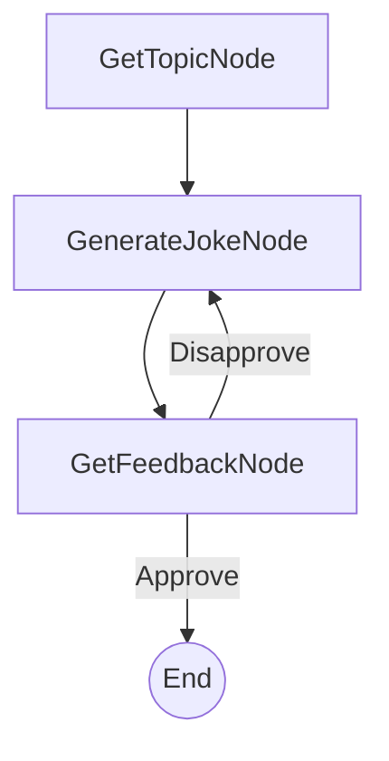

# PocketFlow Command-Line Joke Generator (Human-in-the-Loop Example)

A simple, interactive command-line application that generates jokes based on user-provided topics and direct human feedback. This serves as a clear example of a Human-in-the-Loop (HITL) workflow orchestrated by PocketFlow.

## Features

- **Interactive Joke Generation**: Ask for jokes on any topic.
- **Human-in-the-Loop Feedback**: Dislike a joke? Your feedback directly influences the next generation attempt.
- **Minimalist Design**: A straightforward example of using PocketFlow for HITL tasks.
- **Powered by LLMs**: (Uses Anthropic Claude via an API call for joke generation).

## Getting Started

This project is part of the PocketFlow cookbook examples. It's assumed you have already cloned the [PocketFlow repository](https://github.com/the-pocket/PocketFlow) and are in the `cookbook/pocketflow-cli-hitl` directory.

1.  **Install required dependencies**:
    ```bash
    pip install -r requirements.txt
    ```

2.  **Set up your Anthropic API key**:
    The application uses Anthropic Claude to generate jokes. You need to set your API key as an environment variable.
    ```bash
    export ANTHROPIC_API_KEY="your-anthropic-api-key-here"
    ```
    You can test if your `call_llm.py` utility is working by running it directly:
    ```bash
    python utils/call_llm.py
    ```

3.  **Run the Joke Generator**:
    ```bash
    python main.py
    ```

## How It Works

The system uses a simple PocketFlow workflow:



1.  **GetTopicNode**: Prompts the user to enter a topic for the joke.
2.  **GenerateJokeNode**: Sends the topic (and any previously disliked jokes as context) to an LLM to generate a new joke.
3.  **GetFeedbackNode**: Shows the joke to the user and asks if they liked it.
    *   If **yes** (approved), the application ends.
    *   If **no** (disapproved), the disliked joke is recorded, and the flow loops back to `GenerateJokeNode` to try again.

## Sample Output

Here's an example of an interaction with the Joke Generator:

```
Welcome to the Command-Line Joke Generator!
What topic would you like a joke about? Pocket Flow: 100-line LLM framework

Joke: Pocket Flow: Finally, an LLM framework that fits in your pocket! Too bad your model still needs a data center.
Did you like this joke? (yes/no): no
Okay, let me try another one.

Joke: Pocket Flow: A 100-line LLM framework where 99 lines are imports and the last line is `print("TODO: implement intelligence")`.
Did you like this joke? (yes/no): yes
Great! Glad you liked it.

Thanks for using the Joke Generator!
```

## Files

-   [`main.py`](./main.py): Entry point for the application.
-   [`flow.py`](./flow.py): Defines the PocketFlow graph and node connections.
-   [`nodes.py`](./nodes.py): Contains the definitions for `GetTopicNode`, `GenerateJokeNode`, and `GetFeedbackNode`.
-   [`utils/call_llm.py`](./utils/call_llm.py): Utility function to interact with the LLM (Anthropic Claude).
-   [`requirements.txt`](./requirements.txt): Lists project dependencies.
-   [`docs/design.md`](./docs/design.md): The design document for this application.