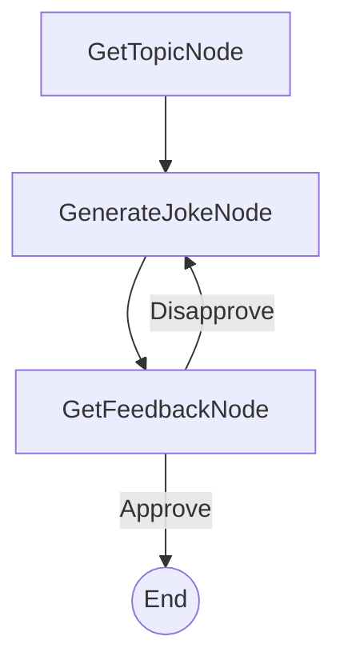

# Design Doc: Command-Line Joke Generator

> Please DON'T remove notes for AI

## Requirements

> Notes for AI: Keep it simple and clear.
> If the requirements are abstract, write concrete user stories

The system will be a command-line application that:
1. Asks the user for a topic for a joke.
2. Generates a joke based on the provided topic.
3. Asks the user if they approve of the joke.
4. If the user approves, the application can end or offer to generate another joke (for simplicity, we'll end for now).
5. If the user does not approve, the application should:
    a. Take note that the user disliked the previous joke.
    b. Generate a new joke about the same topic, attempting to make it different from the disliked one.
    c. Repeat step 3.

## Flow Design

> Notes for AI:
> 1. Consider the design patterns of agent, map-reduce, rag, and workflow. Apply them if they fit.
> 2. Present a concise, high-level description of the workflow.

### Applicable Design Pattern:

**Agent**: The system acts as an agent that interacts with the user. It takes user input (topic, feedback), performs an action (generates a joke), and then decides the next step based on user feedback (either end or try generating another joke). This iterative process of generation and feedback fits the agent pattern.

### Flow high-level Design:

1.  **GetTopicNode**: Prompts the user to enter the topic for the joke.
2.  **GenerateJokeNode**: Generates a joke based on the topic and any previous feedback.
3.  **GetFeedbackNode**: Presents the joke to the user and asks for approval. Based on the feedback, it either transitions to end the flow or back to `GenerateJokeNode`.


## Utility Functions

> Notes for AI:
> 1. Understand the utility function definition thoroughly by reviewing the doc.
> 2. Include only the necessary utility functions, based on nodes in the flow.

1.  **Call LLM** (`utils/call_llm.py`)
    *   *Input*: `prompt` (str), potentially including context like previously disliked jokes.
    *   *Output*: `response` (str) - the generated joke.
    *   *Necessity*: Used by `GenerateJokeNode` to generate jokes.

## Node Design

### Shared Store

> Notes for AI: Try to minimize data redundancy

The shared store structure is organized as follows:

```python
shared = {
    "topic": None,             # Stores the user-provided joke topic
    "current_joke": None,      # Stores the most recently generated joke
    "disliked_jokes": [],    # A list to store jokes the user didn't like, for context
    "user_feedback": None      # Stores the user's latest feedback (e.g., "approve", "disapprove")
}
```

### Node Steps

> Notes for AI: Carefully decide whether to use Batch/Async Node/Flow.

1.  **GetTopicNode**
    *   *Purpose*: To get the desired joke topic from the user.
    *   *Type*: Regular
    *   *Steps*:
        *   `prep`: (None needed for the first run, or could check if a topic already exists if we were to loop for a new topic)
        *   `exec`: Prompt the user via `input()` for a joke topic.
        *   `post`: Store the user's input topic into `shared["topic"]`. Return `"default"` action to proceed to `GenerateJokeNode`.

2.  **GenerateJokeNode**
    *   *Purpose*: To generate a joke using an LLM, based on the topic and any previously disliked jokes.
    *   *Type*: Regular
    *   *Steps*:
        *   `prep`: Read `shared["topic"]` and `shared["disliked_jokes"]`. Construct a prompt for the LLM, including the topic and a message like "The user did not like the following jokes: [list of disliked jokes]. Please generate a new, different joke about [topic]."
        *   `exec`: Call the `call_llm` utility function with the prepared prompt.
        *   `post`: Store the generated joke in `shared["current_joke"]`. Print the joke to the console. Return `"default"` action to proceed to `GetFeedbackNode`.

3.  **GetFeedbackNode**
    *   *Purpose*: To get feedback from the user about the generated joke and decide the next step.
    *   *Type*: Regular
    *   *Steps*:
        *   `prep`: Read `shared["current_joke"]`.
        *   `exec`: Prompt the user (e.g., "Did you like this joke? (yes/no) or (approve/disapprove): "). Get user's input.
        *   `post`:
            *   If user input indicates approval (e.g., "yes", "approve"):
                *   Store "approve" in `shared["user_feedback"]`.
                *   Return `"Approve"` action (leading to flow termination or a thank you message).
            *   If user input indicates disapproval (e.g., "no", "disapprove"):
                *   Store "disapprove" in `shared["user_feedback"]`.
                *   Add `shared["current_joke"]` to the `shared["disliked_jokes"]` list.
                *   Return `"Disapprove"` action (leading back to `GenerateJokeNode`).
