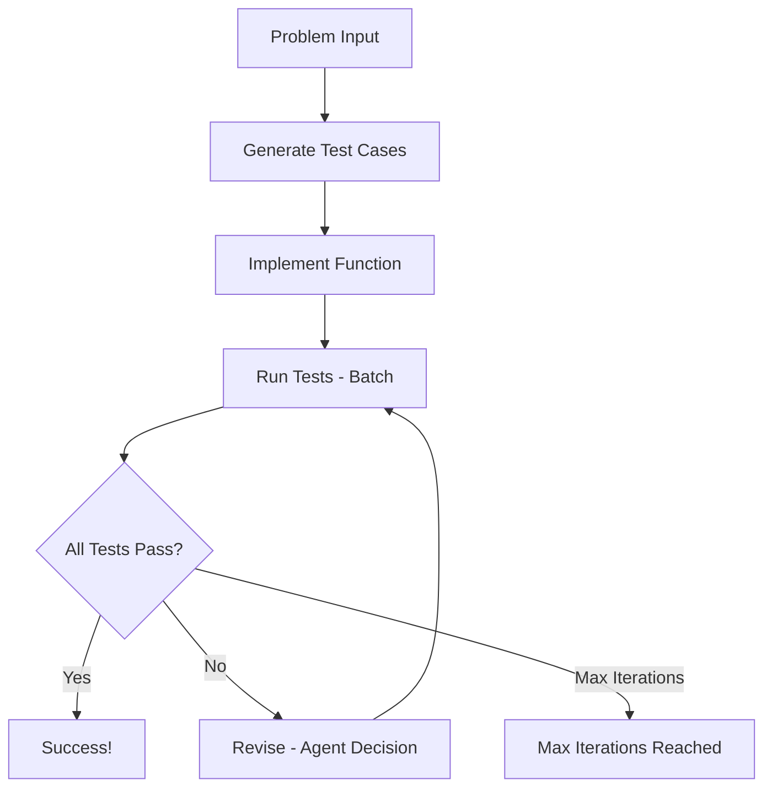

# PocketFlow Code Generator

An intelligent AI system that takes LeetCode-style coding problems and automatically generates comprehensive test cases, implements solutions, and iteratively improves them until all tests pass.

- Check out the [Substack Post Tutorial](https://pocketflow.substack.com/p/build-your-own-ai-code-generator) for more!

## Features

- **Automatic Test Case Generation**: Creates diverse test cases including edge cases
- **Intelligent Code Implementation**: Generates `run_code` functions with proper algorithms
- **Iterative Improvement**: Analyzes failures and decides whether to revise tests or code
- **Rich Debugging Output**: Detailed progress tracking and validation

## Getting Started

1. Install required dependencies:
```bash
pip install -r requirements.txt
```

2. Set up your Anthropic API key:
    ```bash
    export ANTHROPIC_API_KEY="your-api-key-here"
    ```
    Test your API key is working:
    ```bash
    python utils/call_llm.py
    ```

3. Run the code generator with the default Two Sum problem:
```bash
python main.py
```

4. Or provide your own problem:
```bash
python main.py "Reverse a linked list. Given the head of a singly linked list, reverse the list and return the reversed list."
```

## How It Works

The system follows an intelligent workflow combining **Agent** and **Workflow** design patterns:



### The Process

1. **GenerateTestCases**: Creates 5-7 comprehensive test cases from problem description
2. **ImplementFunction**: Writes a `run_code` function based on problem and test cases  
3. **RunTests**: Executes function against all test cases using batch processing
4. **Revise**: Analyzes failures and makes intelligent decisions to revise test cases and/or function code
5. **Loop**: Continues until all tests pass or max iterations reached

## Sample Output

Here's what you'll see when running the Two Sum example:

```
Starting PocketFlow Code Generator...

=== Generated 7 Test Cases ===
1. Basic case - solution at beginning
   input: {'nums': [2, 7, 11, 15], 'target': 9}
   expected: [0, 1]
2. Basic case - solution in middle
   input: {'nums': [3, 2, 4], 'target': 6}
   expected: [1, 2]
3. Edge case - minimum array size with duplicates
   input: {'nums': [3, 3], 'target': 6}
   expected: [0, 1]
4. Case with negative numbers
   input: {'nums': [-1, -2, -3, -4, -5], 'target': -8}
   expected: [2, 4]
5. Case with zero and negative target
   input: {'nums': [0, 4, 3, 0], 'target': 0}
   expected: [0, 3]
6. Case with solution at the end
   input: {'nums': [1, 2, 3, 4, 5, 6], 'target': 11}
   expected: [4, 5]
7. Larger array case
   input: {'nums': [5, 75, 25, 45, 42, 2, 11, 9, 55, 12], 'target': 14}
   expected: [2, 6]

=== Implemented Function ===
def run_code(nums, target):
    # Dictionary to store number -> index mapping
    num_to_index = {}
    
    # Iterate through the array
    for i, num in enumerate(nums):
        # Calculate what number we need to reach the target
        complement = target - num
        
        # Check if the complement exists in our map
        if complement in num_to_index:
            # Found the pair! Return indices
            return [num_to_index[complement], i]
        
        # Store current number and its index
        num_to_index[num] = i
    
    # Should never reach here given problem constraints
    return []

=== Test Results: 6/7 Passed ===
Failed tests:
1. Larger array case:
   error: Expected [2, 6], got [0, 7]
   expected: [2, 6]

=== Revisions (Iteration 1) ===
Revising test cases:
  Test 7: 'Larger array case' -> 'Larger array case'
    old input: {'nums': [5, 75, 25, 45, 42, 2, 11, 9, 55, 12], 'target': 14}
    new input: {'nums': [5, 75, 25, 45, 42, 2, 11, 9, 55, 12], 'target': 14}
    old expected: [2, 6]
    new expected: [0, 7]

=== Test Results: 7/7 Passed ===
```

## Key Features

### Intelligent Decision Making
The **Revise** node acts as an agent that analyzes test failures and decides whether to:
- Fix test cases (if they have incorrect expected outputs)  
- Fix the function implementation (if the logic is wrong)
- Or both

### Structured Output with Validation
All LLM interactions use YAML format with:
- **Reasoning fields**: Transparent decision-making process
- **Validation asserts**: Ensures outputs match expected structure
- **Rich debugging**: Comprehensive logging of all steps

### Batch Processing
The **RunTests** node uses PocketFlow's BatchNode to efficiently test the function against all test cases in parallel.

## Files

- [`main.py`](./main.py): Entry point with sample Two Sum problem
- [`flow.py`](./flow.py): Connects all nodes into the complete workflow  
- [`nodes.py`](./nodes.py): Core logic nodes with validation and debugging
- [`utils/call_llm.py`](./utils/call_llm.py): Anthropic Claude API wrapper
- [`utils/code_executor.py`](./utils/code_executor.py): Safe Python code execution utility
- [`doc/design.md`](./doc/design.md): Detailed system design documentation

## Design Patterns Used

- **[Workflow](https://the-pocket.github.io/PocketFlow/design_pattern/workflow.html)**: Sequential steps of test generation → coding → testing
- **[Agent](https://the-pocket.github.io/PocketFlow/design_pattern/agent.html)**: Intelligent decision-making when tests fail
- **[Batch](https://the-pocket.github.io/PocketFlow/core_abstraction/batch.html)**: Efficient parallel test execution
- **[Structured Output](https://the-pocket.github.io/PocketFlow/design_pattern/structure.html)**: YAML validation for reliable LLM outputs 
