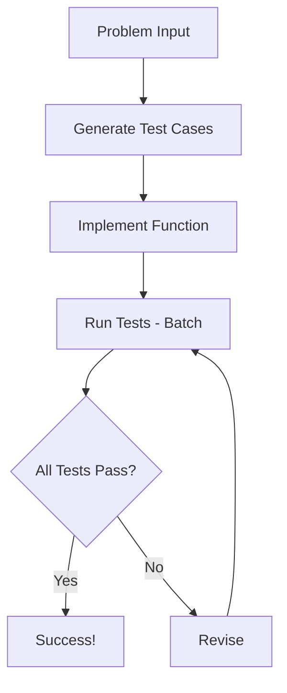

# Design Doc: PocketFlow Code Generator

> Please DON'T remove notes for AI

## Requirements

> Notes for AI: Keep it simple and clear.
> If the requirements are abstract, write concrete user stories

**User Story**: As a developer, I want an AI system that can take a LeetCode-style coding problem and automatically:
1. Generate comprehensive test cases including edge cases
2. Implement a solution function
3. Test the implementation against the test cases
4. When tests fail, intelligently decide whether to revise the test cases or the function
5. Iterate until all tests pass

**Sample Problem**: Two Sum - Given an array of integers and a target, return indices of two numbers that add up to the target.

This is well-suited for AI because:
- ✅ Routine task: Test case generation follows patterns
- ✅ Creative task: Code generation from clear problem descriptions  
- ✅ Clear decision criteria: Whether to revise tests vs implementation

## Flow Design

> Notes for AI:
> 1. Consider the design patterns of agent, map-reduce, rag, and workflow. Apply them if they fit.
> 2. Present a concise, high-level description of the workflow.

### Applicable Design Pattern:

1. **Workflow Pattern**: Sequential steps of test generation → coding → testing
2. **Agent Pattern**: Decision-making when tests fail with structured output
   - *Context*: Test results, current test cases, and function code
   - *Actions*: Structured output to revise test cases and/or function

### Flow high-level Design:

1. **Generate Test Cases**: Create comprehensive input/output test pairs from problem description
2. **Implement Function**: Write `def run_code` function based on problem and current test cases  
3. **Run Tests**: Execute function against all test cases using batch processing
4. **Revise**: Analyze failures and output structured revisions for test cases and/or function
5. **Loop back to Run Tests** until all pass



## Utility Functions

> Notes for AI:
> 1. Understand the utility function definition thoroughly by reviewing the doc.
> 2. Include only the necessary utility functions, based on nodes in the flow.

1. **Call LLM** (`utils/call_llm.py`)
   - *Input*: prompt (str)
   - *Output*: response (str)
   - Used by all LLM-powered nodes for generating tests, code, and analysis

2. **Execute Python Code** (`utils/code_executor.py`)
   - *Input*: function_code (str), input (dict/list/any)
   - *Output*: output (any), error (str)
   - Used by RunTests batch node to safely execute generated code against individual input

## Node Design

### Shared Memory

> Notes for AI: Try to minimize data redundancy

The shared memory structure is organized as follows:

```python
shared = {
    "problem": "Given an array of integers nums and an integer target, return indices of the two numbers such that they add up to target.",
    "test_cases": [
        {"name": "Basic case", "input": {"nums": [2,7,11,15], "target": 9}, "expected": [0,1]},
        {"name": "Different order", "input": {"nums": [3,2,4], "target": 6}, "expected": [1,2]},
        # ... more test cases
    ],
    "function_code": "def run_code(nums, target): ...",
    "test_results": [
        {"test_case": {...}, "passed": True/False, "error": "..."},
        # ... results for each test case
    ],
    "iteration_count": 0,
    "max_iterations": 5
}
```

### Node Steps

> Notes for AI: Carefully decide whether to use Batch/Async Node/Flow.

1. **GenerateTestCases Node**
  - *Purpose*: Create comprehensive test cases including edge cases from problem description
  - *Type*: Regular Node
  - *Steps*:
    - *prep*: Read problem description from shared store
    - *exec*: Call LLM to generate diverse test cases in structured format
    - *post*: Store test cases directly in shared["test_cases"]

2. **ImplementFunction Node**
  - *Purpose*: Generate `def run_code` function based on problem and current test cases
  - *Type*: Regular Node  
  - *Steps*:
    - *prep*: Read problem description and test cases from shared store
    - *exec*: Call LLM to implement `def run_code` function with clean code output
    - *post*: Store function code directly in shared["function_code"]

3. **RunTests Node**
  - *Purpose*: Execute function against all test cases using batch processing
  - *Type*: Batch Node
  - *Steps*:
    - *prep*: Read function code from shared store, return list of test cases
    - *exec*: Use code executor utility to run function against each individual test case
    - *post*: Store all results in shared["test_results"], return "success" if all pass else "failure"

4. **Revise Node** (Agent with Structured Output)
  - *Purpose*: Analyze test failures and output structured revisions for test cases and/or function
  - *Type*: Regular Node (Agent decision-making)
  - *Steps*:
    - *prep*: Read test results, test cases, function code, iteration count from shared store
    - *exec*: Call LLM to analyze failures and output structured YAML with revised test cases and/or function code
    - *post*: Update shared["test_cases"] and/or shared["function_code"] based on structured output
