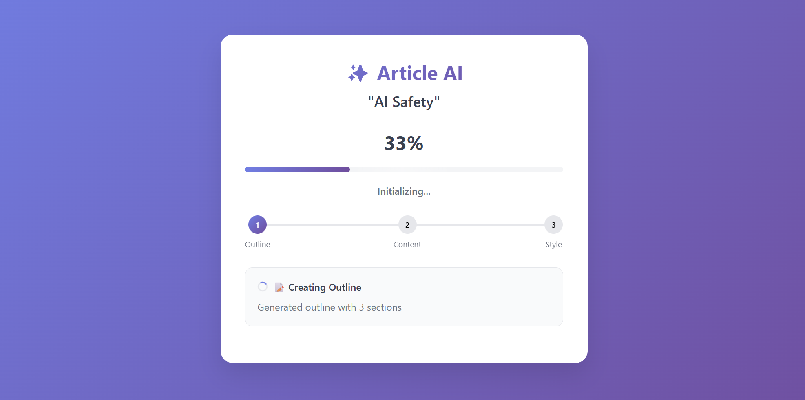

# PocketFlow FastAPI Background Jobs with Real-time Progress

A web application demonstrating PocketFlow workflows running as FastAPI background jobs with real-time progress updates via Server-Sent Events (SSE).

<p align="center">
  
</p>

## Features

- **Modern Web UI**: Clean interface with real-time progress visualization
- **Background Processing**: Non-blocking article generation using FastAPI BackgroundTasks
- **Server-Sent Events**: Real-time progress streaming without polling
- **Granular Progress**: Section-by-section updates during content generation
- **PocketFlow Integration**: Three-node workflow (Outline → Content → Style)

## How to Run

1. Install Dependencies:
   ```bash
   pip install -r requirements.txt
   ```

2. Set your OpenAI API key:
   ```bash
   export OPENAI_API_KEY=your_api_key_here
   ```

3. Run the FastAPI Server:
   ```bash
   python main.py
   ```

4. Access the Web UI:
   Open your browser and navigate to `http://localhost:8000`.

5. Use the Application:
   - Enter an article topic or click suggested topics
   - Click "Generate Article" to start background processing
   - Watch real-time progress updates with step indicators
   - Copy the final article when complete

## How It Works

The application uses PocketFlow to define a three-step article generation workflow. FastAPI handles web requests and manages real-time SSE communication for progress updates.

**PocketFlow Workflow:**


1. **`GenerateOutline`**: Creates structured outline with up to 3 sections
2. **`WriteContent` (BatchNode)**: Writes content for each section individually, sending progress updates
3. **`ApplyStyle`**: Polishes the article with conversational tone

**FastAPI & SSE Integration:**

- The `/start-job` endpoint creates a unique job, initializes an SSE queue, and schedules the workflow using `BackgroundTasks`
- Nodes send progress updates to the job-specific `sse_queue` during execution
- The `/progress/{job_id}` endpoint streams real-time updates to the client via Server-Sent Events
- The web UI displays progress with animated bars, step indicators, and detailed status messages

**Progress Updates:**
- 33%: Outline generation complete
- 33-66%: Content writing (individual section updates)
- 66-100%: Style application
- 100%: Article ready

## Files

- [`main.py`](./main.py): FastAPI application with background jobs and SSE endpoints
- [`flow.py`](./flow.py): PocketFlow workflow definition connecting the three nodes
- [`nodes.py`](./nodes.py): Workflow nodes (GenerateOutline, WriteContent BatchNode, ApplyStyle)
- [`utils/call_llm.py`](./utils/call_llm.py): OpenAI LLM utility function
- [`static/index.html`](./static/index.html): Modern job submission form with topic suggestions
- [`static/progress.html`](./static/progress.html): Real-time progress monitoring with animations