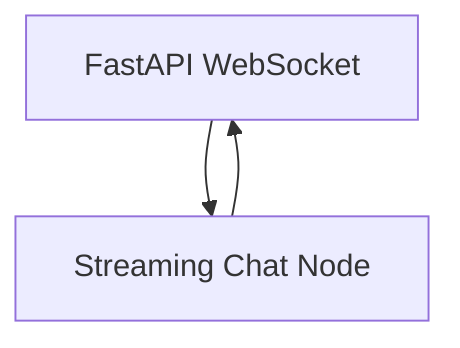

# PocketFlow FastAPI WebSocket Chat Interface

A minimal real-time chat interface built with FastAPI, WebSocket, and PocketFlow that supports streaming LLM responses.

## Features

- 🚀 **Real-time Communication**: WebSocket-based bidirectional communication
- 📡 **Streaming Responses**: See AI responses being typed out in real-time
- 🔄 **Persistent Connection**: Stay connected throughout the conversation
- 💬 **Conversation History**: Maintains context across messages
- 🎨 **Modern UI**: Clean, responsive chat interface
- 🛠️ **Minimal Dependencies**: Built with minimal, production-ready dependencies

## Quick Start

### 1. Install Dependencies

```bash
pip install -r requirements.txt
```

### 2. Set Up OpenAI API Key (Optional)

For real LLM responses, set your OpenAI API key:

```bash
export OPENAI_API_KEY="your-api-key-here"
```

### 3. Run the Application

```bash
python main.py
```

### 4. Open in Browser

Navigate to: `http://localhost:8000`

## Architecture

This application uses a **simplified single-node pattern** with PocketFlow:



### Components

- **FastAPI**: Web framework with WebSocket support
- **PocketFlow**: Single node handles message processing and LLM streaming
- **Streaming LLM**: Real-time response generation

### File Structure

```
cookbook/pocketflow-fastapi-websocket/
├── main.py              # FastAPI application with WebSocket endpoint
├── nodes.py             # Single PocketFlow node for chat processing
├── flow.py              # Simple flow with one node
├── utils/
│   └── stream_llm.py    # LLM streaming utilities
├── requirements.txt     # Dependencies
├── README.md           # This file
└── docs/
    └── design.md       # Detailed design documentation
```

## Usage

1. **Start a Conversation**: Type a message and press Enter or click Send
2. **Watch Streaming**: See the AI response appear in real-time
3. **Continue Chatting**: The conversation maintains context automatically
4. **Multiple Users**: Each WebSocket connection has its own conversation

## Development

### Using Real OpenAI API

To use real OpenAI API instead of fake responses:

1. Set your API key: `export OPENAI_API_KEY="your-key"`
2. In `nodes.py`, change line 35 from `fake_stream_llm(formatted_prompt)` to `stream_llm(formatted_prompt)`

### Testing

Test the PocketFlow logic without WebSocket:

```bash
python test_flow.py
```

Test the streaming utility:

```bash
cd utils
python stream_llm.py
```

### Customization

- **Modify System Prompt**: Edit the system prompt in `nodes.py` StreamingChatNode
- **Change UI**: Update the HTML template in `main.py`
- **Add Features**: Extend the single node or add new nodes to the flow

## Why This Simple Design?

This implementation demonstrates PocketFlow's philosophy of **minimal complexity**:

- **Single Node**: One node handles message processing, LLM calls, and streaming
- **No Utility Bloat**: Direct JSON handling instead of wrapper functions
- **Clear Separation**: FastAPI handles WebSocket, PocketFlow handles LLM logic
- **Easy to Extend**: Simple to add features like RAG, agents, or multi-step workflows

## Production Considerations

- **Connection Management**: Use Redis or database for connection storage
- **Rate Limiting**: Add rate limiting for API calls
- **Error Handling**: Enhance error handling and user feedback
- **Authentication**: Add user authentication if needed
- **Scaling**: Use multiple workers with proper session management

## Technology Stack

- **Backend**: FastAPI + WebSocket
- **Frontend**: Pure HTML/CSS/JavaScript
- **AI Framework**: PocketFlow (single node)
- **LLM**: OpenAI GPT-4
- **Real-time**: WebSocket with streaming

## License

MIT License 