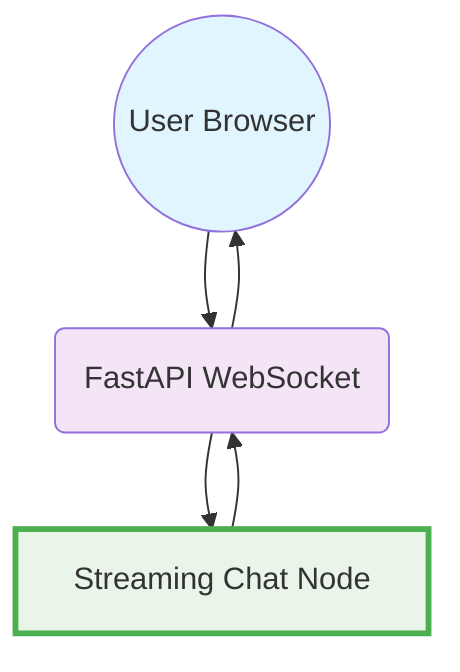

# Design Doc: FastAPI WebSocket Chat Interface

> Please DON'T remove notes for AI

## Requirements

> Notes for AI: Keep it simple and clear.
> If the requirements are abstract, write concrete user stories

**User Story**: As a user, I want to interact with an AI chatbot through a web interface where:
1. I can send messages and receive real-time streaming responses
2. The connection stays persistent (WebSocket)
3. I can see the AI response being typed out in real-time
4. The interface is minimal and easy to use

**Technical Requirements**:
- FastAPI backend with WebSocket support
- Real-time bidirectional communication
- LLM streaming integration using PocketFlow
- Simple HTML/JavaScript frontend
- Minimal dependencies

## Flow Design

> Notes for AI:
> 1. Consider the design patterns of agent, map-reduce, rag, and workflow. Apply them if they fit.
> 2. Present a concise, high-level description of the workflow.

### Applicable Design Pattern:

**Single Node Pattern**: One PocketFlow node handles the entire LLM streaming process

### Flow high-level Design:

**PocketFlow Flow**: Just one node
1. **Streaming Chat Node**: Processes message, calls LLM, streams response

**Integration**: FastAPI WebSocket endpoint calls the PocketFlow flow



## Utility Functions

> Notes for AI:
> 1. Understand the utility function definition thoroughly by reviewing the doc.
> 2. Include only the necessary utility functions, based on nodes in the flow.

1. **Stream LLM** (`utils/stream_llm.py`)
   - *Input*: prompt (str)
   - *Output*: streaming response chunks
   - Used by streaming chat node to get LLM chunks

## Node Design

### Shared Store

> Notes for AI: Try to minimize data redundancy

The shared store structure is organized as follows:

```python
shared = {
    "websocket": None,           # WebSocket connection object
    "user_message": "",          # Current user message
    "conversation_history": []   # List of message history
}
```

### Node Steps

> Notes for AI: Carefully decide whether to use Batch/Async Node/Flow.

1. **Streaming Chat Node**
  - *Purpose*: Process user message, call LLM with streaming, and send chunks via WebSocket
  - *Type*: Regular Node
  - *Steps*:
    - *prep*: Read user message and conversation history, format prompt
    - *exec*: Call streaming LLM utility
    - *post*: Stream chunks via WebSocket and update conversation history
