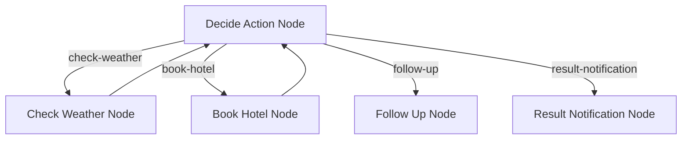
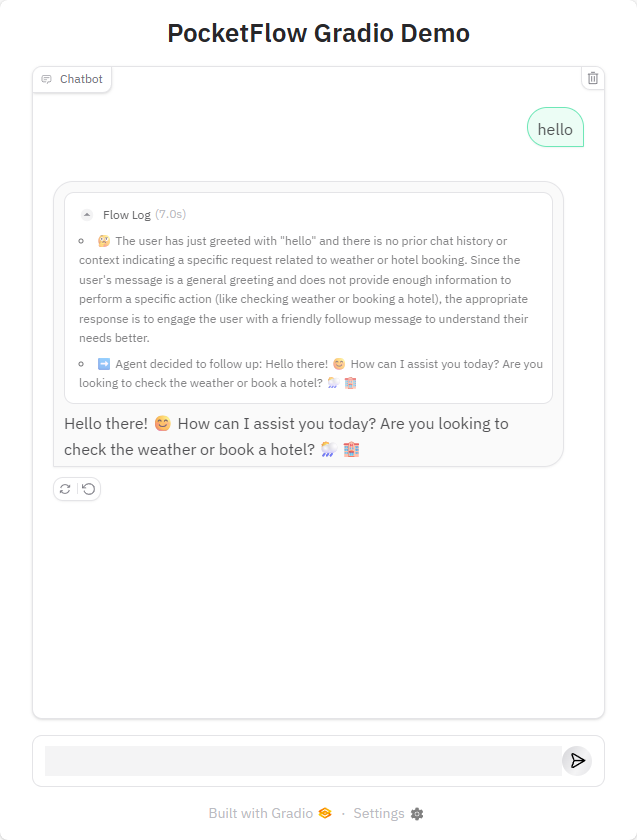
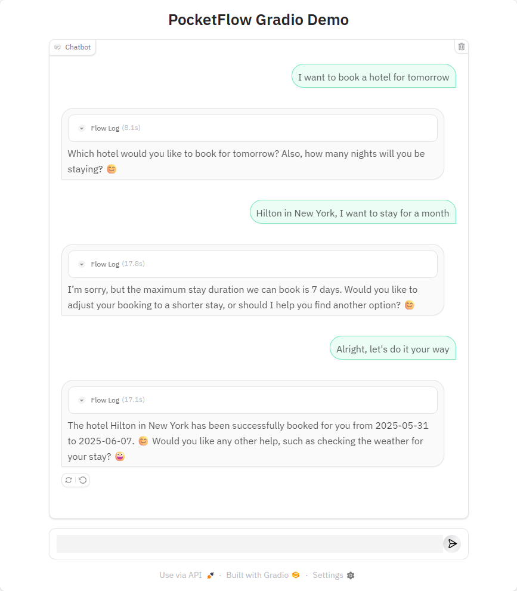
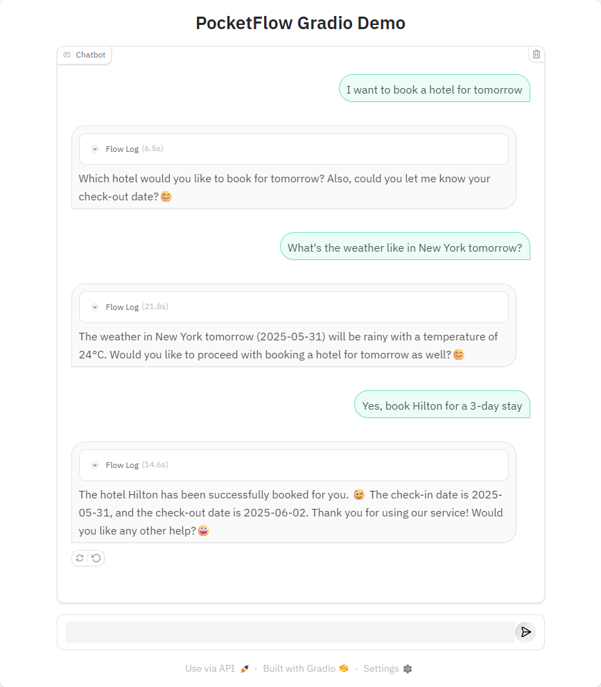

# PocketFlow Gradio HITL Example

A web-based application that demonstrates Human-in-the-Loop (HITL) workflow orchestration using PocketFlow and Gradio. This example provides an interactive interface for users to engage with AI-powered tasks while maintaining human oversight and feedback.

## Features

- **Web-based Interface**: Built with Gradio for an accessible and user-friendly experience
- **Human-in-the-Loop Integration**: Seamless integration of human feedback into the AI workflow
- **Modern UI**: Clean and intuitive interface for better user interaction
- **Powered by LLMs**: Utilizes OpenAI's models for intelligent task processing
- **Flow Visualization**: Real-time visualization of node execution sequence and workflow progress
- **Interactive Debugging**: Monitor and understand the decision-making process through visual feedback

## Getting Started

This project is part of the PocketFlow cookbook examples. It's assumed you have already cloned the [PocketFlow repository](https://github.com/the-pocket/PocketFlow) and are in the `cookbook/pocketflow-gradio-hitl` directory.

1. **Install required dependencies**:
    ```bash
    pip install -r requirements.txt
    ```

2. **Set up your OpenAI API key**:
    The application uses OpenAI models for processing. You need to set your API key as an environment variable:
    ```bash
    export OPENAI_API_KEY="your-openai-api-key-here"
    ```

3. **Run the Application**:
    ```bash
    python main.py
    ```
    This will start the Gradio web interface, typically accessible at `http://localhost:7860`

## How It Works

The system implements a PocketFlow workflow with a web interface:



The workflow consists of the following nodes:

1. **Decide Action Node**: The central decision-making node that determines the next action based on user input and context
2. **Check Weather Node**: Provides weather information for specified cities and dates
3. **Book Hotel Node**: Handles hotel reservation requests with check-in and check-out dates
4. **Follow Up Node**: Manages user interactions by asking clarifying questions or handling out-of-scope requests
5. **Result Notification Node**: Delivers action results and offers additional assistance

The flow is orchestrated through a series of directed connections:
- The Decide Action node can trigger weather checks, hotel bookings, follow-ups, or result notifications
- Weather checks and hotel bookings can feed back to the Decide Action node for further processing
- Follow-up and result notification nodes provide the final steps in the workflow

### Flow Visualization

The application provides real-time visualization of the workflow execution:
- The sequence of node activations is displayed chronologically
- Users can see which decision paths are being taken
- The visualization helps in understanding the AI's decision-making process



## Sample Output

Here's an example of book hotel:



Here's an example of changing intention mid-conversation:



## Files

- [`main.py`](./main.py): Entry point for the application and Gradio interface setup
- [`flow.py`](./flow.py): Defines the PocketFlow graph and node connections
- [`nodes.py`](./nodes.py): Contains the node definitions for the workflow
- [`utils/`](./utils/): Contains utility functions and helper modules
- [`requirements.txt`](./requirements.txt): Lists project dependencies

## Requirements

- Python 3.8+
- PocketFlow >= 0.0.2
- Gradio >= 5.29.1
- OpenAI >= 1.78.1
