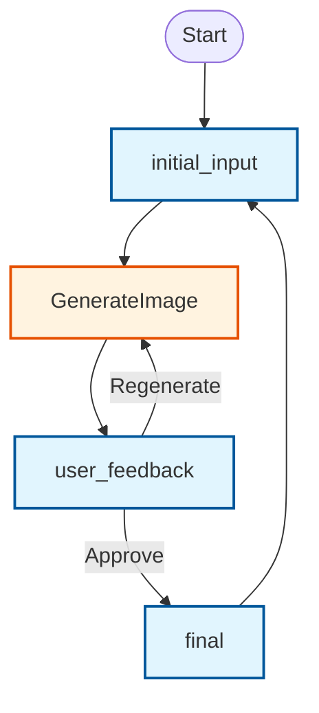

# Design Doc: PocketFlow Streamlit Image Generation HITL

> Human-in-the-Loop image generation application using PocketFlow and Streamlit

## Requirements

**User Story**: As a user, I want to:
1. Enter a text prompt describing an image I want to generate
2. Have the system generate an image based on my prompt using OpenAI's image generation API
3. Review the generated image in the web interface
4. Approve the image if I'm satisfied, OR regenerate with the same prompt if I want a different result
5. See the final approved image as the completed result

**Technical Requirements**:
- Use OpenAI's image generation API (via responses.create with image_generation tool)
- Keep generated images in memory (base64 format) - no disk storage
- Provide clear approve/regenerate workflow
- Handle API errors gracefully with retries
- Maintain session state between generations

## Flow Design

### Applicable Design Pattern:

**State Machine with Multiple Subflows**: Each state has its own user interface and workflow. Users interact with different UI elements in each state, and the app transitions to the next state based on user actions and feedback.

### States & User Interface:

1. **initial_input** - User sees text input field, enters prompt, clicks "Generate Image" button
2. **user_feedback** - User sees generated image, has "Approve" and "Regenerate" buttons 
3. **final** - User sees final approved image and "Start Over" button

### Flow High-level Design & Transitions:



**Legend:**
- 🔷 **Blue rectangles**: User interface states (initial_input, user_feedback, final)
- 🔶 **Orange rectangles**: PocketFlow processing nodes (GenerateImage)

## Utility Functions

1. **Generate Image** (`utils/generate_image.py`)
   - *Input*: prompt (str)
   - *Output*: base64 image data (str)
   - *Purpose*: Calls OpenAI's image generation API and returns base64 encoded image
   - *Error Handling*: Includes retry logic for API failures

## Node Design

### Shared Memory

**Using Streamlit Session State as Shared Store**: We use `st.session_state` directly as the shared store for PocketFlow, eliminating the need for separate data structures.

The session state structure for the image generation workflow:

```python
st.session_state = {
    # User input and workflow state
    "task_input": "user's text prompt for image generation",
    "stage": "current workflow stage (initial_input/user_feedback/final)",
    "error_message": "any error messages for user feedback",
    
    # Processing data
    "input_used_by_process": "prompt used for generation",
    "generated_image": "base64 encoded image data",
    "final_result": "final approved image data",
    
    # Streamlit built-in keys (managed automatically)
    # "_streamlit_*": various internal streamlit state
}
```

### Node Steps

**Initial Input Flow Nodes:**

1. **Image Generation Node**
   - *Purpose*: Generate image using OpenAI API based on the prompt
   - *Type*: Regular (with retries for API reliability)
   - *Steps*:
     - *prep*: Read "input_used_by_process" from st.session_state
     - *exec*: Call generate_image utility with the prompt, return base64 image data
     - *post*: Write base64 image data to "generated_image" in st.session_state

**User Feedback Flow:**
- Reuses the same `GenerateImage` node when user clicks "Regenerate"

**Final Flow:**
- No processing nodes needed - the `final` state simply displays the approved image from `generated_image` and provides UI for starting over
