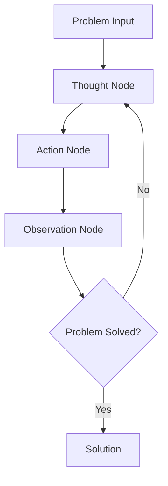

# PocketFlow TAO (Thought-Action-Observation)

A powerful pattern that enables AI agents to solve complex problems through structured thinking, action execution, and result observation. This example demonstrates how to implement the TAO pattern using PocketFlow.

## Project Structure

```
.
├── flow.py        # PocketFlow implementation of TAO pattern
├── main.py        # Main application entry point
├── nodes.py       # TAO node definitions
├── requirements.txt # Project dependencies
└── README.md      # Project documentation
```

## Overview

The TAO pattern consists of three key steps:
1. **Thought**: The agent deeply analyzes the problem and forms a solution strategy
2. **Action**: Concrete actions are executed based on the thinking
3. **Observation**: Results are evaluated and feedback is gathered

This cycle continues until the problem is solved or termination conditions are met.

## Setup

1. Create a virtual environment:
```bash
python -m venv venv
source venv/bin/activate  # On Windows: venv\Scripts\activate
```

2. Install dependencies:
```bash
pip install -r requirements.txt
```

3. Set API key (if using specific LLM services):
```bash
export OPENAI_API_KEY="your-api-key-here"
# Or set in code
```

## How to Run

Execute the example:
```bash
python main.py
```

## How It Works

The TAO pattern is implemented as a flow in PocketFlow, with each step handled by specialized nodes:



Each TAO cycle generates new insights for the problem-solving process, allowing the AI to iteratively approach an optimal solution.

## Use Cases

- Complex problem solving
- Multi-step reasoning tasks
- Projects requiring iterative improvement
- Reinforcement learning-style AI applications

## Example Output

```
Query: I need to understand the latest developments in artificial intelligence

🤔 Thought 1: Decided to execute search
🚀 Executing action: search, input: latest developments in artificial intelligence 2023
✅ Action completed, result obtained
👁️ Observation: The search result indicates that information was r...
🎯 Final Answer: As of October 2023, some of the latest developments in artificial intelligence include advances in large language models like GPT-4, increased focus on AI alignment and safety, improvements in reinforcement learning, and the integration of AI into more industries such as healthcare, finance, and autonomous vehicles. Researchers are also exploring ethical considerations and regulatory frameworks to ensure responsible AI deployment. For the most current updates beyond this date, I recommend checking recent publications, official AI research organization releases, or news sources specializing in technology.

Flow ended, thank you for using!

Final Answer:
As of October 2023, some of the latest developments in artificial intelligence include advances in large language models like GPT-4, increased focus on AI alignment and safety, improvements in reinforcement learning, and the integration of AI into more industries such as healthcare, finance, and autonomous vehicles. Researchers are also exploring ethical considerations and regulatory frameworks to ensure responsible AI deployment. For the most current updates beyond this date, I recommend checking recent publications, official AI research organization releases, or news sources specializing in technology.
```

## Advanced Usage

The TAO pattern can be extended by:
- Adding memory components to store past thoughts and observations.
- Implementing adaptive action selection strategies.
- Integrating external tools and APIs.
- Adding human feedback loops.
- Adding max attempt to control the iteration.

## Additional Resources

- [PocketFlow Documentation](https://the-pocket.github.io/PocketFlow/)
- [Understanding AI Agents through the Thought-Action-Observation Cycle](https://huggingface.co/learn/agents-course/en/unit1/agent-steps-and-structure)