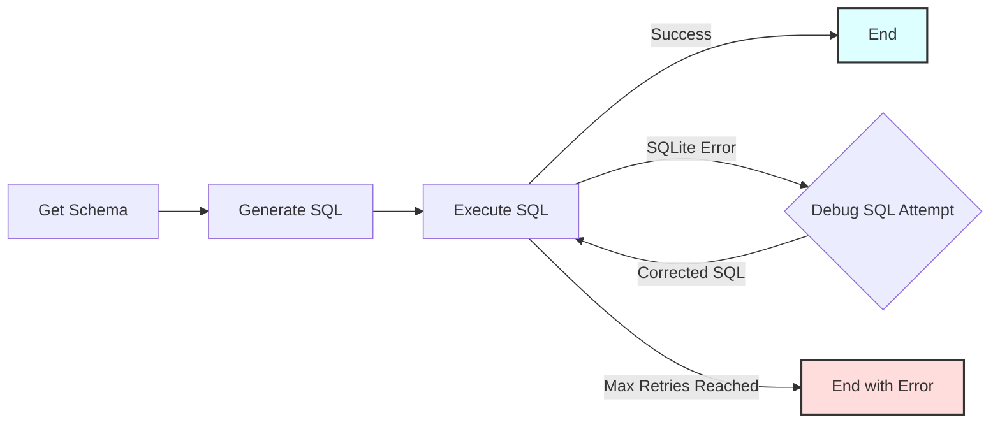

# Text-to-SQL Workflow

A PocketFlow example demonstrating a text-to-SQL workflow that converts natural language questions into executable SQL queries for an SQLite database, including an LLM-powered debugging loop for failed queries.

- Check out the [Substack Post Tutorial](https://zacharyhuang.substack.com/p/text-to-sql-from-scratch-tutorial) for more!

## Features

-   **Schema Awareness**: Automatically retrieves the database schema to provide context to the LLM.
-   **LLM-Powered SQL Generation**: Uses an LLM (GPT-4o) to translate natural language questions into SQLite queries (using YAML structured output).
-   **Automated Debugging Loop**: If SQL execution fails, an LLM attempts to correct the query based on the error message. This process repeats up to a configurable number of times.
## Getting Started

1.  **Install Packages:**
    ```bash
    pip install -r requirements.txt
    ```

2.  **Set API Key:**
    Set the environment variable for your OpenAI API key.
    ```bash
    export OPENAI_API_KEY="your-api-key-here"
    ```
    *(Replace `"your-api-key-here"` with your actual key)*

3.  **Verify API Key (Optional):**
    Run a quick check using the utility script. If successful, it will print a short joke.
    ```bash
    python utils.py
    ```
    *(Note: This requires a valid API key to be set.)*

4.  **Run Default Example:**
    Execute the main script. This will create the sample `ecommerce.db` if it doesn't exist and run the workflow with a default query.
    ```bash
    python main.py
    ```
    The default query is:
    > Show me the names and email addresses of customers from New York

5.  **Run Custom Query:**
    Provide your own natural language query as command-line arguments after the script name.
    ```bash
    python main.py What is the total stock quantity for products in the 'Accessories' category?
    ```
    Or, for queries with spaces, ensure they are treated as a single argument by the shell if necessary (quotes might help depending on your shell):
    ```bash
    python main.py "List orders placed in the last 30 days with status 'shipped'"
    ```

## How It Works

The workflow uses several nodes connected in a sequence, with a loop for debugging failed SQL queries.



**Node Descriptions:**

1.  **`GetSchema`**: Connects to the SQLite database (`ecommerce.db` by default) and extracts the schema (table names and columns).
2.  **`GenerateSQL`**: Takes the natural language query and the database schema, prompts the LLM to generate an SQLite query (expecting YAML output with the SQL), and parses the result.
3.  **`ExecuteSQL`**: Attempts to run the generated SQL against the database.
    *   If successful, the results are stored, and the flow ends successfully.
    *   If an `sqlite3.Error` occurs (e.g., syntax error), it captures the error message and triggers the debug loop.
4.  **`DebugSQL`**: If `ExecuteSQL` failed, this node takes the original query, schema, failed SQL, and error message, prompts the LLM to generate a *corrected* SQL query (again, expecting YAML).
5.  **(Loop)**: The corrected SQL from `DebugSQL` is passed back to `ExecuteSQL` for another attempt.
6.  **(End Conditions)**: The loop continues until `ExecuteSQL` succeeds or the maximum number of debug attempts (default: 3) is reached.

## Files

-   [`main.py`](./main.py): Main entry point to run the workflow. Handles command-line arguments for the query.
-   [`flow.py`](./flow.py): Defines the PocketFlow `Flow` connecting the different nodes, including the debug loop logic.
-   [`nodes.py`](./nodes.py): Contains the `Node` classes for each step (`GetSchema`, `GenerateSQL`, `ExecuteSQL`, `DebugSQL`).
-   [`utils.py`](./utils.py): Contains the minimal `call_llm` utility function.
-   [`populate_db.py`](./populate_db.py): Script to create and populate the sample `ecommerce.db` SQLite database.
-   [`requirements.txt`](./requirements.txt): Lists Python package dependencies.
-   [`README.md`](./README.md): This file.

## Example Output (Successful Run)

```
=== Starting Text-to-SQL Workflow ===
Query: 'total products per category'
Database: ecommerce.db
Max Debug Retries on SQL Error: 3
=============================================

===== DB SCHEMA =====

Table: customers
  - customer_id (INTEGER)
  - first_name (TEXT)
  - last_name (TEXT)
  - email (TEXT)
  - registration_date (DATE)
  - city (TEXT)
  - country (TEXT)

Table: sqlite_sequence
  - name ()
  - seq ()

Table: products
  - product_id (INTEGER)
  - name (TEXT)
  - description (TEXT)
  - category (TEXT)
  - price (REAL)
  - stock_quantity (INTEGER)

Table: orders
  - order_id (INTEGER)
  - customer_id (INTEGER)
  - order_date (TIMESTAMP)
  - status (TEXT)
  - total_amount (REAL)
  - shipping_address (TEXT)

Table: order_items
  - order_item_id (INTEGER)
  - order_id (INTEGER)
  - product_id (INTEGER)
  - quantity (INTEGER)
  - price_per_unit (REAL)

=====================


===== GENERATED SQL (Attempt 1) =====

SELECT category, COUNT(*) AS total_products
FROM products
GROUP BY category

====================================

SQL executed in 0.000 seconds.

===== SQL EXECUTION SUCCESS =====

category | total_products
-------------------------
Accessories | 3
Apparel | 1
Electronics | 3
Home Goods | 2
Sports | 1

=== Workflow Completed Successfully ===
====================================
```
