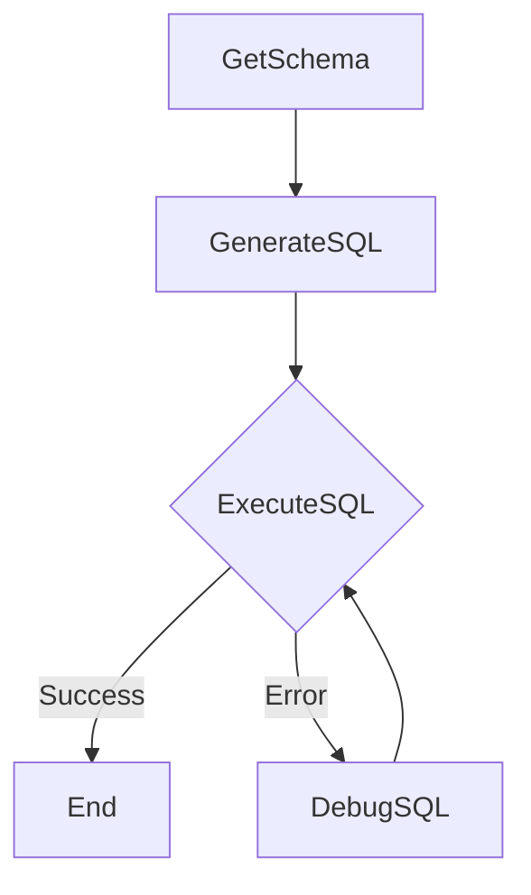

# Design Doc: Text-to-SQL Agent

> Please DON'T remove notes for AI

## Requirements

> Notes for AI: Keep it simple and clear.
> If the requirements are abstract, write concrete user stories

The system should take a natural language query and a path to an SQLite database as input. It should then:
1.  Extract the schema from the database.
2.  Generate an SQL query based on the natural language query and the schema.
3.  Execute the SQL query against the database.
4.  If the SQL execution fails, attempt to debug and retry the SQL generation and execution up to a specified maximum number of attempts.
5.  Return the final results of the SQL query or an error message if the process fails.

## Flow Design

> Notes for AI:
> 1. Consider the design patterns of agent, map-reduce, rag, and workflow. Apply them if they fit.
> 2. Present a concise, high-level description of the workflow.

### Applicable Design Pattern:

The primary design pattern is a **Workflow** with an embedded **Agent**-like behavior for debugging.
-   **Workflow**: The process follows a sequence: Get Schema -> Generate SQL -> Execute SQL.
-   **Agent (for Debugging)**: If `ExecuteSQL` fails, the `DebugSQL` node acts like an agent, taking the error and previous SQL as context to generate a revised SQL query. This forms a loop back to `ExecuteSQL`.

### Flow high-level Design:

1.  **`GetSchema`**: Retrieves the database schema.
2.  **`GenerateSQL`**: Generates an SQL query from a natural language question and the schema.
3.  **`ExecuteSQL`**: Executes the generated SQL. If successful, the flow ends. If an error occurs, it transitions to `DebugSQL`.
4.  **`DebugSQL`**: Attempts to correct the failed SQL query based on the error message. It then transitions back to `ExecuteSQL` to try the corrected query.



## Utility Functions

> Notes for AI:
> 1. Understand the utility function definition thoroughly by reviewing the doc.
> 2. Include only the necessary utility functions, based on nodes in the flow.

1.  **Call LLM** (`utils/call_llm.py`)
    *   *Input*: `prompt` (str)
    *   *Output*: `response` (str)
    *   *Necessity*: Used by `GenerateSQL` and `DebugSQL` nodes to interact with the language model for SQL generation and correction.

*Database interaction (e.g., `sqlite3.connect`, `cursor.execute`) is handled directly within the nodes and is not abstracted into separate utility functions in this implementation.*

## Node Design

### Shared Store

> Notes for AI: Try to minimize data redundancy

The shared store structure is organized as follows:

```python
shared = {
    "db_path": "path/to/database.db",       # Input: Path to the SQLite database
    "natural_query": "User's question",      # Input: Natural language query from the user
    "max_debug_attempts": 3,                # Input: Max retries for the debug loop
    "schema": None,                         # Output of GetSchema: String representation of DB schema
    "generated_sql": None,                  # Output of GenerateSQL/DebugSQL: The SQL query string
    "execution_error": None,                # Output of ExecuteSQL (on failure): Error message
    "debug_attempts": 0,                    # Internal: Counter for debug attempts
    "final_result": None,                   # Output of ExecuteSQL (on success): Query results
    "result_columns": None,                 # Output of ExecuteSQL (on success): Column names for results
    "final_error": None                     # Output: Overall error message if flow fails after retries
}
```

### Node Steps

> Notes for AI: Carefully decide whether to use Batch/Async Node/Flow.

1.  **`GetSchema`**
    *   *Purpose*: To extract and store the schema of the target SQLite database.
    *   *Type*: Regular
    *   *Steps*:
        *   *`prep`*: Reads `db_path` from the shared store.
        *   *`exec`*: Connects to the SQLite database, inspects `sqlite_master` and `PRAGMA table_info` to build a string representation of all tables and their columns.
        *   *`post`*: Writes the extracted `schema` string to the shared store.

2.  **`GenerateSQL`**
    *   *Purpose*: To generate an SQL query based on the user's natural language query and the database schema.
    *   *Type*: Regular
    *   *Steps*:
        *   *`prep`*: Reads `natural_query` and `schema` from the shared store.
        *   *`exec`*: Constructs a prompt for the LLM, including the schema and the natural language query, asking for an SQL query in YAML format. Calls the `call_llm` utility. Parses the YAML response to extract the SQL query.
        *   *`post`*: Writes the `generated_sql` to the shared store. Resets `debug_attempts` to 0.

3.  **`ExecuteSQL`**
    *   *Purpose*: To execute the generated SQL query against the database and handle results or errors.
    *   *Type*: Regular
    *   *Steps*:
        *   *`prep`*: Reads `db_path` and `generated_sql` from the shared store.
        *   *`exec`*: Connects to the SQLite database and executes the `generated_sql`. It determines if the query is a SELECT or an DML/DDL statement to fetch results or commit changes. Returns a tuple `(success_boolean, result_or_error_message, column_names_list)`.
        *   *`post`*:
            *   If successful: Stores `final_result` and `result_columns` in the shared store. Returns no action (ends the flow path).
            *   If failed: Stores `execution_error` in the shared store. Increments `debug_attempts`. If `debug_attempts` is less than `max_debug_attempts`, returns `"error_retry"` action to trigger the `DebugSQL` node. Otherwise, sets `final_error` and returns no action.

4.  **`DebugSQL`**
    *   *Purpose*: To attempt to correct a failed SQL query using LLM based on the error message.
    *   *Type*: Regular
    *   *Steps*:
        *   *`prep`*: Reads `natural_query`, `schema`, `generated_sql` (the failed one), and `execution_error` from the shared store.
        *   *`exec`*: Constructs a prompt for the LLM, providing the failed SQL, the original query, the schema, and the error message, asking for a corrected SQL query in YAML format. Calls the `call_llm` utility. Parses the YAML response to extract the corrected SQL query.
        *   *`post`*: Overwrites `generated_sql` in the shared store with the corrected SQL. Removes `execution_error` from the shared store. Returns a default action to go back to `ExecuteSQL`.
