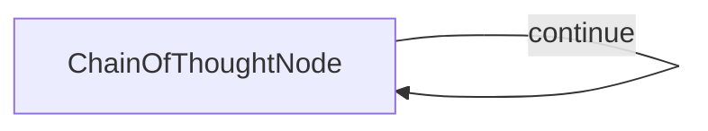

# Chain of Thought Node Design

## 1. Requirements
Create a self-looping Chain of Thought node that can:
- Solve a problem step-by-step by maintaining and executing a structured plan.
- Critically evaluate the previous step's reasoning and results before proceeding.
- Refine the plan by breaking down complex steps into nested sub-steps.
- Update the status of plan steps (`Pending`, `Done`, `Verification Needed`) and record concise results.
- Handle potential errors identified during evaluation by adjusting the plan.
- Provide a detailed trace of the thinking process and plan evolution.
- Generate a final conclusion summarizing the solution when the plan is complete.

## 2. Flow Design
This will be a simple flow with a single node that can call itself repeatedly based on whether more thinking is needed according to the plan:



## 3. Utilities
We'll need one primary utility function:
- `call_llm`: Call the LLM to generate the next thought (including evaluation, thinking, and updated plan) based on the problem, previous thoughts, and the current plan state. Helper functions (`format_plan`, `format_plan_for_prompt`) assist in presenting the plan.

## 4. Node Design
### Shared Store Design
```python
shared = {
    "problem": str,             # The problem statement.
    "thoughts": list[dict],     # List of thought dictionaries generated so far.
    "current_thought_number": int, # Counter for the current thought being generated.
    "solution": str | None    # Stores the final conclusion text when finished.
}
```

Each thought dictionary added to the `shared["thoughts"]` list will contain the structured output from the LLM's execution step, plus the thought number:
```python
{
    "thought_number": int,      # The sequence number of this thought.
    "current_thinking": str,    # Detailed text of the evaluation and thinking for this step.
    "planning": list[dict],     # The updated plan structure (list of dictionaries).
    "next_thought_needed": bool # Flag indicating if the loop should continue.
}
```

The `planning` list contains dictionaries representing steps, which can be nested:
```python
# Example structure for a plan step dictionary
{
    "description": str,                     # Description of the step.
    "status": str,                          # "Pending", "Done", "Verification Needed".
    "result": str | None,                   # Optional: Concise result when status is "Done".
    "mark": str | None,                     # Optional: Reason for "Verification Needed".
    "sub_steps": list[dict] | None          # Optional: Nested list for sub-steps.
}
```

### Chain of Thought Node (`ChainOfThoughtNode`)
-   **`type`**: Regular (self-looping node).
-   **`prep`**:
    -   Reads the problem statement and the list of previous thoughts from the shared store.
    -   Formats the history of thoughts and the *last known plan structure* into a text representation suitable for the LLM prompt.
    -   Determines if this is the first thought to adjust prompt instructions.
    -   Increments and updates `shared["current_thought_number"]`.
-   **`exec`**:
    -   Constructs a detailed prompt for the LLM, including:
        -   The problem statement.
        -   The formatted history of previous thoughts and plans.
        -   Specific instructions for evaluating the previous thought, executing the next pending step, updating the plan structure (using the dictionary format), handling sub-steps, managing statuses/results, and indicating completion.
        -   The required YAML output format (`current_thinking`, `planning`, `next_thought_needed`).
    -   Calls the `call_llm` utility with the prompt.
    -   Parses the LLM's YAML response.
    -   Validates the presence and basic types of required keys (`current_thinking`, `planning`, `next_thought_needed`) using `assert`.
    -   Adds the `thought_number` to the parsed data.
-   **`post`**:
    -   Appends the result dictionary from `exec` to the `shared["thoughts"]` list.
    -   Checks the `next_thought_needed` flag from the execution result.
    -   If `False`:
        -   Extracts the `current_thinking` content as the final `shared["solution"]`.
        -   Prints the final thought, plan, and solution.
        -   Returns `"end"` to terminate the flow loop.
    -   If `True`:
        -   Prints the current thought number, thinking content, and formatted current plan status.
        -   Returns `"continue"` to trigger the next iteration of the node.