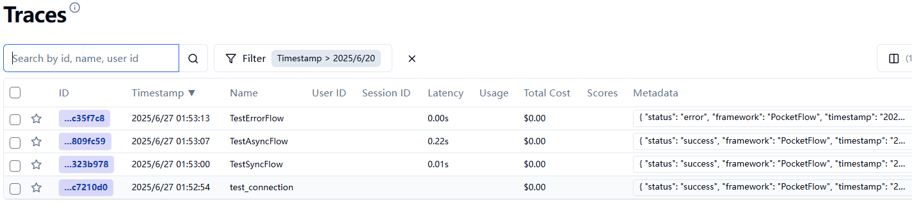
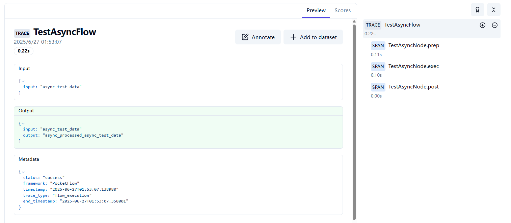

# PocketFlow Tracing with Langfuse

This cookbook provides comprehensive observability for PocketFlow workflows using [Langfuse](https://langfuse.com/) as the tracing backend. With minimal code changes (just adding a decorator), you can automatically trace all node executions, inputs, outputs, and errors in your PocketFlow workflows.

## 🎯 Features

- **Automatic Tracing**: Trace entire flows with a single decorator
- **Node-Level Observability**: Automatically trace `prep`, `exec`, and `post` phases of each node
- **Input/Output Tracking**: Capture all data flowing through your workflow
- **Error Tracking**: Automatically capture and trace exceptions
- **Async Support**: Full support for AsyncFlow and AsyncNode
- **Minimal Code Changes**: Just add `@trace_flow()` to your flow classes
- **Langfuse Integration**: Leverage Langfuse's powerful observability platform

## 🚀 Quick Start

### 1. Install Dependencies

```bash
pip install -r requirements.txt
```

### 2. Environment Setup

Copy the example environment file and configure your Langfuse credentials:

```bash
cp .env.example .env
```

Then edit the `.env` file with your actual Langfuse configuration:

```env
LANGFUSE_SECRET_KEY=your-langfuse-secret-key
LANGFUSE_PUBLIC_KEY=your-langfuse-public-key
LANGFUSE_HOST=your-langfuse-host-url
POCKETFLOW_TRACING_DEBUG=true
```

**Note**: Replace the placeholder values with your actual Langfuse credentials and host URL.

### 3. Basic Usage

```python
from pocketflow import Node, Flow
from tracing import trace_flow

class MyNode(Node):
    def prep(self, shared):
        return shared["input"]
    
    def exec(self, data):
        return f"Processed: {data}"
    
    def post(self, shared, prep_res, exec_res):
        shared["output"] = exec_res
        return "default"

@trace_flow()  # 🎉 That's it! Your flow is now traced
class MyFlow(Flow):
    def __init__(self):
        super().__init__(start=MyNode())

# Run your flow - tracing happens automatically
flow = MyFlow()
shared = {"input": "Hello World"}
flow.run(shared)
```

## 📊 What Gets Traced

When you apply the `@trace_flow()` decorator, the system automatically traces:

### Flow Level
- **Flow Start/End**: Overall execution time and status
- **Input Data**: Initial shared state when flow starts
- **Output Data**: Final shared state when flow completes
- **Errors**: Any exceptions that occur during flow execution

### Node Level
For each node in your flow, the system traces:

- **prep() Phase**: 
  - Input: `shared` data
  - Output: `prep_res` returned by prep method
  - Execution time and any errors

- **exec() Phase**:
  - Input: `prep_res` from prep phase
  - Output: `exec_res` returned by exec method
  - Execution time and any errors
  - Retry attempts (if configured)

- **post() Phase**:
  - Input: `shared`, `prep_res`, `exec_res`
  - Output: Action string returned
  - Execution time and any errors

## 🔧 Configuration Options

### Basic Configuration

```python
from tracing import trace_flow, TracingConfig

# Use environment variables (default)
@trace_flow()
class MyFlow(Flow):
    pass

# Custom flow name
@trace_flow(flow_name="CustomFlowName")
class MyFlow(Flow):
    pass

# Custom session and user IDs
@trace_flow(session_id="session-123", user_id="user-456")
class MyFlow(Flow):
    pass
```

### Advanced Configuration

```python
from tracing import TracingConfig

# Create custom configuration
config = TracingConfig(
    langfuse_secret_key="your-secret-key",
    langfuse_public_key="your-public-key", 
    langfuse_host="https://your-langfuse-instance.com",
    debug=True,
    trace_inputs=True,
    trace_outputs=True,
    trace_errors=True
)

@trace_flow(config=config)
class MyFlow(Flow):
    pass
```

## 📁 Examples

### Basic Synchronous Flow
See `examples/basic_example.py` for a complete example of tracing a simple synchronous flow.

```bash
cd examples
python basic_example.py
```

### Asynchronous Flow
See `examples/async_example.py` for tracing AsyncFlow and AsyncNode.

```bash
cd examples  
python async_example.py
```

## 🔍 Viewing Traces

After running your traced flows, visit your Langfuse dashboard to view the traces:

**Dashboard URL**: Use the URL you configured in `LANGFUSE_HOST` environment variable

In the dashboard you'll see:
- **Traces**: One trace per flow execution
- **Spans**: Individual node phases (prep, exec, post)
- **Input/Output Data**: All data flowing through your workflow
- **Performance Metrics**: Execution times for each phase
- **Error Details**: Stack traces and error messages

The tracings in examples.


Detailed tracing for a node.


## 🛠️ Advanced Usage

### Custom Tracer Configuration

```python
from tracing import TracingConfig, LangfuseTracer

# Create custom configuration
config = TracingConfig.from_env()
config.debug = True

# Use tracer directly (for advanced use cases)
tracer = LangfuseTracer(config)
```

### Environment Variables

You can customize tracing behavior with these environment variables:

```env
# Required Langfuse configuration
LANGFUSE_SECRET_KEY=your-secret-key
LANGFUSE_PUBLIC_KEY=your-public-key
LANGFUSE_HOST=your-langfuse-host

# Optional tracing configuration
POCKETFLOW_TRACING_DEBUG=true
POCKETFLOW_TRACE_INPUTS=true
POCKETFLOW_TRACE_OUTPUTS=true
POCKETFLOW_TRACE_PREP=true
POCKETFLOW_TRACE_EXEC=true
POCKETFLOW_TRACE_POST=true
POCKETFLOW_TRACE_ERRORS=true

# Optional session/user tracking
POCKETFLOW_SESSION_ID=your-session-id
POCKETFLOW_USER_ID=your-user-id
```

## 🐛 Troubleshooting

### Common Issues

1. **"langfuse package not installed"**
   ```bash
   pip install langfuse
   ```

2. **"Langfuse client initialization failed"**
   - Check your `.env` file configuration
   - Verify Langfuse server is running at the specified host
   - Check network connectivity

3. **"No traces appearing in dashboard"**
   - Ensure `POCKETFLOW_TRACING_DEBUG=true` to see debug output
   - Check that your flow is actually being executed
   - Verify Langfuse credentials are correct

### Debug Mode

Enable debug mode to see detailed tracing information:

```env
POCKETFLOW_TRACING_DEBUG=true
```

This will print detailed information about:
- Langfuse client initialization
- Trace and span creation
- Data serialization
- Error messages

## 📚 API Reference

### `@trace_flow()`

Decorator to add Langfuse tracing to PocketFlow flows.

**Parameters:**
- `config` (TracingConfig, optional): Custom configuration. If None, loads from environment.
- `flow_name` (str, optional): Custom name for the flow. If None, uses class name.
- `session_id` (str, optional): Session ID for grouping related traces.
- `user_id` (str, optional): User ID for the trace.

### `TracingConfig`

Configuration class for tracing settings.

**Methods:**
- `TracingConfig.from_env()`: Create config from environment variables
- `validate()`: Check if configuration is valid
- `to_langfuse_kwargs()`: Convert to Langfuse client kwargs

### `LangfuseTracer`

Core tracer class for Langfuse integration.

**Methods:**
- `start_trace()`: Start a new trace
- `end_trace()`: End the current trace
- `start_node_span()`: Start a span for node execution
- `end_node_span()`: End a node execution span
- `flush()`: Flush pending traces to Langfuse

## 🤝 Contributing

This cookbook is designed to be a starting point for PocketFlow observability. Feel free to extend and customize it for your specific needs!

## 📄 License

This cookbook follows the same license as PocketFlow.
