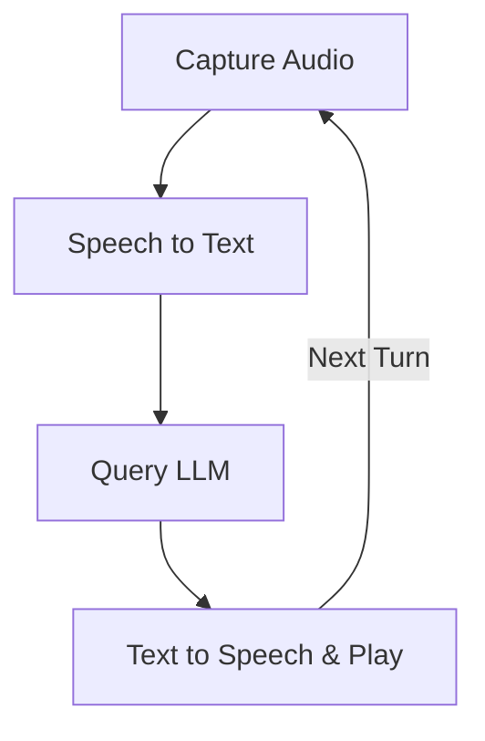

# PocketFlow Voice Chat

This project demonstrates a voice-based interactive chat application built with PocketFlow. Users can speak their queries, and the system will respond with spoken answers from an LLM, maintaining conversation history.

- Check out the [Substack Post Tutorial](https://pocketflow.substack.com/p/build-your-own-voice-chatbot-from) for more!


## Features

-   **Voice Activity Detection (VAD)**: Automatically detects when the user starts and stops speaking.
-   **Speech-to-Text (STT)**: Converts spoken audio into text using OpenAI.
-   **LLM Interaction**: Processes the transcribed text with an LLM (e.g., GPT-4o), maintaining conversation history.
-   **Text-to-Speech (TTS)**: Converts the LLM's text response back into audible speech using OpenAI.
-   **Continuous Conversation**: Loops back to listen for the next user query after responding, allowing for an ongoing dialogue.

## How to Run

1.  **Set your OpenAI API key**:
    ```bash
    export OPENAI_API_KEY="your-api-key-here"
    ```
    Ensure this environment variable is set, as the utility scripts for STT, LLM, and TTS rely on it.
    You can test individual utility functions (e.g., `python utils/call_llm.py`, `python utils/text_to_speech.py`) to help verify your API key and setup.

2.  **Install dependencies**:
    Make sure you have Python installed. Then, install the required libraries using pip:
    ```bash
    pip install -r requirements.txt
    ```
    This will install libraries such as `openai`, `pocketflow`, `sounddevice`, `numpy`, `scipy`, and `soundfile`.

    **Note for Linux users**: `sounddevice` may require PortAudio. If you encounter issues, you might need to install it first:
    ```bash
    sudo apt-get update && sudo apt-get install -y portaudio19-dev
    ```

3.  **Run the application**:
    ```bash
    python main.py
    ```
    Follow the console prompts. The application will start listening when you see "Listening for your query...".

## How It Works

The application uses a PocketFlow workflow to manage the conversation steps:



Here's what each node in the flow does:

1.  **`CaptureAudioNode`**: Records audio from the user's microphone. It uses Voice Activity Detection (VAD) to start recording when speech is detected and stop when silence is detected.
2.  **`SpeechToTextNode`**: Takes the recorded audio data, converts it to a suitable format, and sends it to OpenAI's STT API (gpt-4o-transcribe) to get the transcribed text.
3.  **`QueryLLMNode`**: Takes the transcribed text from the user, along with the existing conversation history, and sends it to an LLM (OpenAI's GPT-4o model) to generate an intelligent response.
4.  **`TextToSpeechNode`**: Receives the text response from the LLM, converts it into audio using OpenAI's TTS API (gpt-4o-mini-tts), and plays the audio back to the user. If the conversation is set to continue, it transitions back to the `CaptureAudioNode`.

## Example Interaction

When you run `main.py`:

1.  The console will display:
    ```
    Starting PocketFlow Voice Chat...
    Speak your query after 'Listening for your query...' appears.
    ...
    ```
2.  When you see `Listening for your query...`, speak clearly into your microphone.
3.  After you stop speaking, the console will show updates:
    ```
    Audio captured (X.XXs), proceeding to STT.
    Converting speech to text...
    User: [Your transcribed query will appear here]
    Sending query to LLM...
    LLM: [The LLM's response text will appear here]
    Converting LLM response to speech...
    Playing LLM response...
    ```
4.  You will hear the LLM's response spoken aloud.
5.  The application will then loop back, and you'll see `Listening for your query...` again, ready for your next input.

The conversation continues in this manner. To stop the application, you typically need to interrupt it (e.g., Ctrl+C in the terminal), as it's designed to loop continuously.
