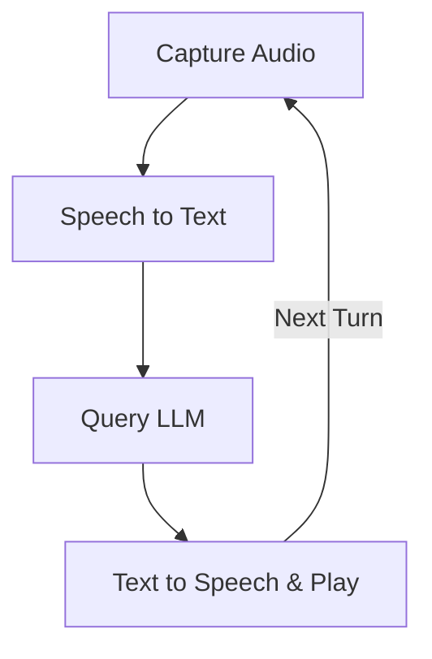

# Design Doc: PocketFlow Voice Chat

> Please DON'T remove notes for AI

## Requirements

> Notes for AI: Keep it simple and clear.
> If the requirements are abstract, write concrete user stories

-   **Goal**: Enable users to interact with an LLM via voice in a continuous conversation, receiving spoken responses.
-   **User Story 1**: As a user, I want to speak my query into a microphone so that the application can understand what I'm asking.
-   **User Story 2**: As a user, I want the application to send my spoken query to an LLM for processing.
-   **User Story 3**: As a user, I want to hear the LLM's response spoken back to me.
-   **User Story 4**: As a user, after hearing the response, I want the application to be ready for my next spoken query without restarting.
-   **Core Functionalities**:
    1.  Capture audio input.
    2.  Convert speech to text (STT).
    3.  Process text with an LLM (maintaining conversation history).
    4.  Convert LLM text response to speech (TTS).
    5.  Play back synthesized audio.
    6.  Loop back to capture new audio input for a continuous conversation.

## Flow Design

> Notes for AI:
> 1. Consider the design patterns of agent, map-reduce, rag, and workflow. Apply them if they fit.
> 2. Present a concise, high-level description of the workflow.

### Applicable Design Pattern:

-   **Workflow**: A sequential workflow with a loop is most appropriate. Each step (audio capture, STT, LLM query, TTS, audio playback) directly follows the previous, and after playback, the flow returns to the audio capture stage.

### Flow high-level Design:

The application will operate in a loop to allow for continuous conversation:
1.  **`CaptureAudioNode`**: Records audio from the user\'s microphone when triggered.
2.  **`SpeechToTextNode`**: Converts the recorded audio into text.
3.  **`QueryLLMNode`**: Sends the transcribed text (with history) to an LLM and gets a text response.
4.  **`TextToSpeechNode`**: Converts the LLM\'s text response into in-memory audio data and then plays it. After completion, the flow transitions back to the `CaptureAudioNode`.



## Utility Functions

> Notes for AI:
> 1. Understand the utility function definition thoroughly by reviewing the doc.
> 2. Include only the necessary utility functions, based on nodes in the flow.

1.  **`record_audio()`** (`utils/audio_utils.py`)
    -   *Input*: (Optional) `sample_rate` (int, Hz, e.g., `DEFAULT_SAMPLE_RATE`), `channels` (int, e.g., `DEFAULT_CHANNELS`), `chunk_size_ms` (int, e.g., `DEFAULT_CHUNK_SIZE_MS`), `silence_threshold_rms` (float, e.g., `DEFAULT_SILENCE_THRESHOLD_RMS`), `min_silence_duration_ms` (int, e.g., `DEFAULT_MIN_SILENCE_DURATION_MS`), `max_recording_duration_s` (int, e.g., `DEFAULT_MAX_RECORDING_DURATION_S`), `pre_roll_chunks_count` (int, e.g., `DEFAULT_PRE_ROLL_CHUNKS`).
    -   *Output*: A tuple `(audio_data, sample_rate)` where `audio_data` is a NumPy array of float32 audio samples, and `sample_rate` is the recording sample rate (int). Returns `(None, sample_rate)` if no speech is detected or recording fails.
    -   *Description*: Records audio from the microphone using silence-based Voice Activity Detection (VAD). Buffers `pre_roll_chunks_count` of audio and starts full recording when sound is detected above `silence_threshold_rms`. Stops after `min_silence_duration_ms` of sound below the threshold or if `max_recording_duration_s` is reached.
    -   *Necessity*: Used by `CaptureAudioNode` to get user\'s voice input.

2.  **`speech_to_text_api(audio_data, sample_rate)`** (`utils/speech_to_text.py`)
    -   *Input*: `audio_data` (bytes), `sample_rate` (int, though the API might infer this from the audio format).
    -   *Output*: `transcribed_text` (str).
    -   *Necessity*: Used by `SpeechToTextNode` to convert in-memory audio data to text.
    -   *Example Model*: OpenAI `gpt-4o-transcribe`.

3.  **`call_llm(messages)`** (`utils/call_llm.py`)
    -   *Input*: `messages` (list of dicts, e.g., `[{"role": "user", "content": "..."}, {"role": "assistant", "content": "..."}]`). This should be the complete conversation history including the latest user query.
    -   *Output*: `llm_response_text` (str)
    -   *Necessity*: Used by `QueryLLMNode` to get an intelligent response.
    -   *Example Model*: OpenAI `gpt-4o`.

4.  **`text_to_speech_api(text_to_synthesize)`** (`utils/text_to_speech.py`)
    -   *Input*: `text_to_synthesize` (str).
    -   *Output*: A tuple `(audio_data, sample_rate)` where `audio_data` is in-memory audio as bytes (e.g., MP3 format from OpenAI) and `sample_rate` is the audio sample rate (int, e.g., 24000 Hz for OpenAI `gpt-4o-mini-tts`).
    -   *Necessity*: Used by `TextToSpeechNode` to convert LLM text to speakable in-memory audio data.
    -   *Example Model*: OpenAI `gpt-4o-mini-tts`.

5.  **`play_audio_data(audio_data, sample_rate)`** (`utils/audio_utils.py`)
    -   *Input*: `audio_data` (NumPy array of float32 audio samples), `sample_rate` (int).
    -   *Output*: None
    -   *Necessity*: Used by `TextToSpeechNode` (in its `post` method) to play the in-memory synthesized speech.

## Node Design

### Shared Memory

> Notes for AI: Try to minimize data redundancy

The shared memory structure is organized as follows:

```python
shared = {
    "user_audio_data": None,      # In-memory audio data (NumPy array) from user
    "user_audio_sample_rate": None, # int: Sample rate of the user audio
    "chat_history": [],            # list: Conversation history [{"role": "user/assistant", "content": "..."}]
    "continue_conversation": True # boolean: Flag to control the main conversation loop
}
```

### Node Steps

> Notes for AI: Carefully decide whether to use Batch/Async Node/Flow.

1.  **`CaptureAudioNode`**
    -   *Purpose*: Record audio input from the user using VAD.
    -   *Type*: Regular
    -   *Steps*:
        -   *prep*: Check `shared["continue_conversation"]`. (Potentially load VAD parameters from `shared["config"]` if dynamic).
        -   *exec*: Call `utils.audio_utils.record_audio()` (passing VAD parameters if configured). This returns a NumPy array and sample rate.
        -   *post*: `audio_numpy_array, sample_rate = exec_res`. Write `audio_numpy_array` to `shared["user_audio_data"]` and `sample_rate` to `shared["user_audio_sample_rate"]`. Returns `"default"`.

2.  **`SpeechToTextNode`**
    -   *Purpose*: Convert the recorded in-memory audio to text.
    -   *Type*: Regular
    -   *Steps*:
        -   *prep*: Read `shared["user_audio_data"]` (NumPy array) and `shared["user_audio_sample_rate"]`. Return `(user_audio_data_numpy, user_audio_sample_rate)`.
        -   *exec*: `audio_numpy_array, sample_rate = prep_res`. **Convert `audio_numpy_array` to audio `bytes` (e.g., in WAV format using `scipy.io.wavfile.write` to an `io.BytesIO` object).** Call `utils.speech_to_text.speech_to_text_api(audio_bytes, sample_rate)`.
        -   *post*:
            -   Let `transcribed_text = exec_res`.
            -   Append `{"role": "user", "content": transcribed_text}` to `shared["chat_history"]`.
            -   Clear `shared["user_audio_data"]` and `shared["user_audio_sample_rate"]` as they are no longer needed.
            -   Returns `"default"` (assuming STT is successful as per simplification).

3.  **`QueryLLMNode`**
    -   *Purpose*: Get a response from the LLM based on the user's query and conversation history.
    -   *Type*: Regular
    -   *Steps*:
        -   *prep*: Read `shared["chat_history"]`. Return `chat_history`.
        -   *exec*: `history = prep_res`. Call `utils.call_llm.call_llm(messages=history)`.
        -   *post*:
            -   Let `llm_response = exec_res`.
            -   Append `{"role": "assistant", "content": llm_response}` to `shared["chat_history"]`.
            -   Returns `"default"` (assuming LLM call is successful).

4.  **`TextToSpeechNode`**
    -   *Purpose*: Convert the LLM's text response into speech and play it.
    -   *Type*: Regular
    -   *Steps*:
        -   *prep*: Read `shared["chat_history"]`. Identify the last message, which should be the LLM's response. Return its content.
        -   *exec*: `text_to_synthesize = prep_res`. Call `utils.text_to_speech.text_to_speech_api(text_to_synthesize)`. This returns `(llm_audio_bytes, llm_sample_rate)`.
        -   *post*: `llm_audio_bytes, llm_sample_rate = exec_res`.
            -   **Convert `llm_audio_bytes` (e.g., MP3 bytes from TTS API) to a NumPy array of audio samples (e.g., using a library like `pydub` or `soundfile` to decode).**
            -   Call `utils.audio_utils.play_audio_data(llm_audio_numpy_array, llm_sample_rate)`.
            -   (Optional) Log completion.
            -   If `shared["continue_conversation"]` is `True`, return `"next_turn"` to loop back.
            -   Otherwise, return `"end_conversation"`.
