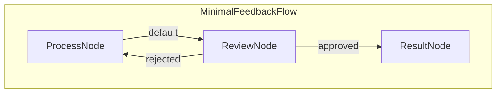

# PocketFlow Web Human-in-the-Loop (HITL) Feedback Service

This project demonstrates a minimal web application for human-in-the-loop workflows using PocketFlow, FastAPI, and Server-Sent Events (SSE). Users can submit text, have it processed (simulated), review the output, and approve or reject it, potentially triggering reprocessing until approved.

<p align="center">
  
</p>

## Features

-   **Web UI:** Simple interface for submitting tasks and providing feedback.
-   **PocketFlow Workflow:** Manages the process -> review -> result/reprocess logic.
-   **FastAPI Backend:** Serves the UI and handles API requests asynchronously.
-   **Server-Sent Events (SSE):** Provides real-time status updates to the client without polling.

## How to Run

1.  Install Dependencies:
    ```bash
    pip install -r requirements.txt
    ```

2.  Run the FastAPI Server:
    Use Uvicorn (or another ASGI server):
    ```bash
    uvicorn server:app --reload --port 8000
    ```
    *(The `--reload` flag is useful for development.)*

3.  Access the Web UI:
    Open your web browser and navigate to `http://127.0.0.1:8000`.

4.  Use the Application:
    *   Enter text into the textarea and click "Submit".
    *   Observe the status updates pushed via SSE.
    *   When prompted ("waiting_for_review"), use the "Approve" or "Reject" buttons.
    *   If rejected, the process loops back. If approved, the final result is displayed.

## How It Works

The application uses PocketFlow to define and execute the feedback loop workflow. FastAPI handles web requests and manages the real-time SSE communication.

**PocketFlow Workflow:**

The core logic is orchestrated by an `AsyncFlow` defined in `flow.py`:



1.  **`ProcessNode`**: Receives input text, calls the minimal `process_task` utility, and stores the output.
2.  **`ReviewNode` (Async)**:
    *   Pushes a "waiting_for_review" status with the processed output to the SSE queue.
    *   Waits asynchronously for an external signal (triggered by the `/feedback` API endpoint).
    *   Based on the received feedback ("approved" or "rejected"), determines the next step in the flow. Stores the result if approved.
3.  **`ResultNode`**: Logs the final approved result.

**FastAPI & SSE Integration:**

*   The `/submit` endpoint creates a unique task, initializes the PocketFlow `shared` state (including an `asyncio.Event` for review and an `asyncio.Queue` for SSE), and schedules the flow execution using `BackgroundTasks`.
*   Nodes within the flow (specifically `ReviewNode`'s prep logic) put status updates onto the task-specific `sse_queue`.
*   The `/stream/{task_id}` endpoint uses `StreamingResponse` to read from the task's `sse_queue` and push formatted status updates to the connected client via Server-Sent Events.
*   The `/feedback/{task_id}` endpoint receives the human's decision, updates the `shared` state, and sets the `asyncio.Event` to unblock the waiting `ReviewNode`.

This setup allows for a decoupled workflow logic (PocketFlow) and web interaction layer (FastAPI), with efficient real-time updates pushed to the user.

## Files

-   [`server.py`](./server.py): The main FastAPI application handling HTTP requests, SSE, state management, and background task scheduling.
-   [`nodes.py`](./nodes.py): Defines the PocketFlow `Node` classes (`ProcessNode`, `ReviewNode`, `ResultNode`) for the workflow steps.
-   [`flow.py`](./flow.py): Defines the PocketFlow `AsyncFlow` that connects the nodes into the feedback loop.
-   [`utils/process_task.py`](./utils/process_task.py): Contains the minimal simulation function for task processing.
-   [`templates/index.html`](./templates/index.html): The HTML structure for the frontend user interface.
-   [`static/style.css`](./static/style.css): Basic CSS for styling the frontend.
-   [`requirements.txt`](./requirements.txt): Project dependencies (FastAPI, Uvicorn, Jinja2, PocketFlow).
