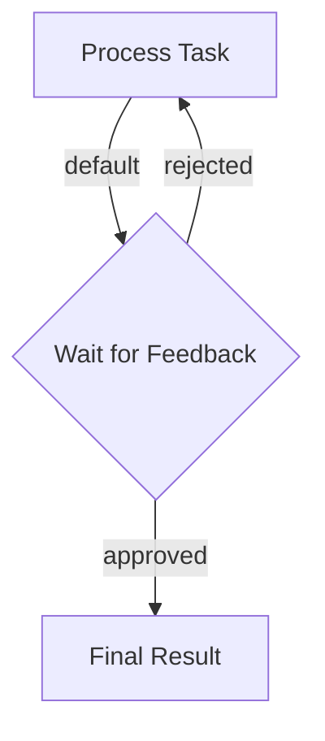

#  Human-in-the-Loop Web Service

## 1. Requirements

*   **Goal:** Create a web service for task submission, processing, human review (Approve/Reject loop via UI), and finalization.
*   **Interface:** Simple web UI (HTML/JS) for input, status display, and feedback buttons.
*   **Backend:** FastAPI using PocketFlow for workflow management.
*   **Real-time Updates:** Use Server-Sent Events (SSE) to push status changes (pending, running, waiting_for_review, completed, failed) and intermediate results to the client without page reloads.
*   **State:** Use in-memory storage for task state (Warning: Not suitable for production).

## 2. Flow Design

*   **Core Pattern:** Workflow with a conditional loop based on human feedback. SSE for asynchronous status communication.
*   **Nodes:**
    1.  `ProcessNode` (Regular): Takes input, executes the (simulated) task processing.
    2.  `ReviewNode` (Async): Waits for human feedback signaled via an `asyncio.Event`. Pushes "waiting\_for\_review" status to the SSE queue.
    3.  `ResultNode` (Regular): Marks the task as complete and logs the final result.
*   **Shared Store (`shared` dict per task):**
    *   `task_input`: Initial data from user.
    *   `processed_output`: Result from `ProcessNode`.
    *   `feedback`: 'approved' or 'rejected' set by the `/feedback` endpoint.
    *   `review_event`: `asyncio.Event` used by `ReviewNode` to wait and `/feedback` to signal.
    *   `final_result`: The approved output.
    *   `current_attempt`: Tracks reprocessing count.
    *   `task_id`: Unique identifier for the task.
*   **SSE Communication:** An `asyncio.Queue` (stored alongside the `shared` store in the server's global `tasks` dict, *not directly in PocketFlow's shared store*) is used per task. Nodes (or wrapper code) put status updates onto this queue. The `/stream` endpoint reads from the queue and sends SSE messages.
*   **Mermaid Diagram:**

## 3. Utilities

For this specific example, the core "utility" is the processing logic itself. Let's simulate it with a simple function. The FastAPI server acts as the external interface.

* `process_task(input_data)`: A placeholder function. In a real scenario, this might call an LLM (`utils/call_llm.py`).

## 4. Node Design (Detailed)

*   **`ProcessNode` (Node):**
    *   `prep`: Reads `task_input`, `current_attempt` from `shared`.
    *   `exec`: Calls `utils.process_task.process_task`.
    *   `post`: Writes `processed_output` to `shared`, increments `current_attempt`. Returns "default".
*   **`ReviewNode` (AsyncNode):**
    *   `prep_async`: (As modified/wrapped by server.py) Reads `review_event`, `processed_output` from `shared`. **Puts "waiting\_for\_review" status onto the task's SSE queue.**
    *   `exec_async`: `await shared["review_event"].wait()`.
    *   `post_async`: Reads `feedback` from `shared`. Clears the event. Returns "approved" or "rejected". If approved, stores `processed_output` into `final_result`.
*   **`ResultNode` (Node):**
    *   `prep`: Reads `final_result` from `shared`.
    *   `exec`: Prints/logs the final result.
    *   `post`: Returns `None` (ends flow).