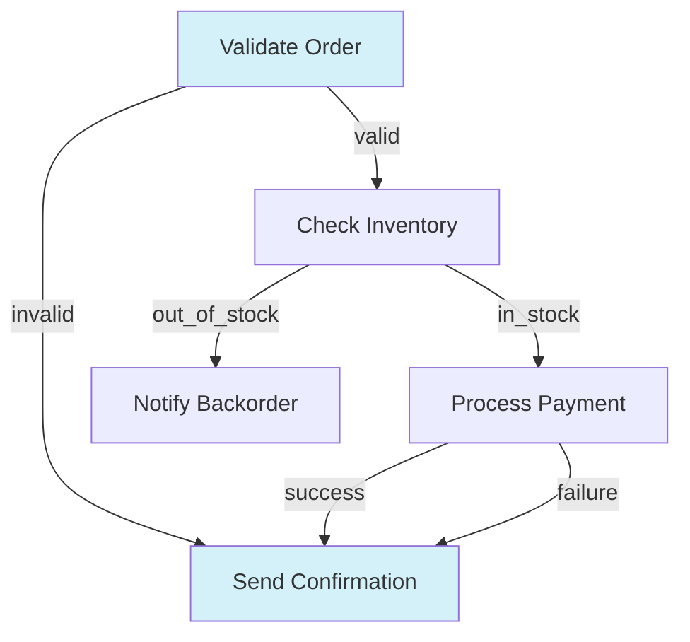

# Flow

In **Mini LLM Flow**, a **Flow** orchestrates how Nodes connect and run, based on **Actions** returned from each Node’s `post()` method. You can chain Nodes in a sequence or create branching logic depending on the **Action** string.

## Action-based Transitions

Each Node’s `post(shared, prep_res, exec_res)` returns a string called **Action**. By default, if `post()` doesn’t explicitly return anything, we treat that as `"default"`.

You define transitions with the syntax:

```python 
node_a >> node_b
```  
- This means if `node_a.post()` returns `"default"` (or `None`), go to `node_b`.

```python
node_a - "action_name" >> node_b
```  
- This means if `node_a.post()` returns `"action_name"`, go to `node_b`.

It’s possible to create loops, branching, or multi-step flows. You can also chain with multiple Actions from a single node to different successors:

```python
# Define nodes for order processing
validate_order = ValidateOrderNode()
check_inventory = CheckInventoryNode()
process_payment = ProcessPaymentNode()
send_confirmation = SendConfirmationNode()
notify_backorder = NotifyBackorderNode()

# Define the flow
validate_order - "valid" >> check_inventory
validate_order - "invalid" >> send_confirmation  # Send rejection confirmation

check_inventory - "in_stock" >> process_payment
check_inventory - "out_of_stock" >> notify_backorder

process_payment - "success" >> send_confirmation
process_payment - "failure" >> send_confirmation  # Send payment failure notice
```



## Creating a Flow

A **Flow** begins with a **start** node (or flow). You call `Flow(start=some_node)` to specify the entry point. When you call `flow.run(shared)`, it executes the first node, looks at its `post()` return Action, follows the corresponding transition, and continues until there’s no next node or you explicitly stop.

```flow = Flow(start=node_a)```


## Example: Simple Sequence

Here’s a minimal flow of two nodes in a chain:

```python
node_a >> node_b
flow = Flow(start=node_a)
flow.run(shared)
```

- When you run the flow, it executes `node_a`.  
- Suppose `node_a.post()` returns `"default"`.  
- The flow then sees `"default"` Action is linked to `node_b` and runs `node_b`.  
- If `node_b.post()` returns `"default"` but we didn’t define `node_b >> something_else`, the flow ends there.

## Example: Branching & Looping

Suppose `FindRelevantFile` can return three possible Actions in its `post()`:

- `"end"`: means no question, so stop.  
- `"answer"`: means we have a relevant file, move to `AnswerQuestion`.  
- `"retry"`: means no relevant file found, try again.

We can wire them:

``` 
find_relevant_file - "end"    >> no_op_node
find_relevant_file - "answer" >> answer_question
find_relevant_file - "retry"  >> find_relevant_file
flow = Flow(start=find_relevant_file)
```

1. If `FindRelevantFile.post()` returns `"answer"`, the flow calls `answer_question`.
2. If `FindRelevantFile.post()` returns `"retry"`, it loops back to itself.
3. If `"end"`, it goes to `no_op_node`. If `no_op_node` has no further transitions, the flow stops.

## Running Individual Nodes vs. Running a Flow

- **`node.run(shared)`**: Just runs that node alone (calls `prep()`, `exec()`, `post()`), returns an Action. **Does not** proceed automatically to the successor. This is mainly for debugging or testing a single node.
- **`flow.run(shared)`**: Executes from the start node, follows Actions to the next node, and so on until the flow can’t continue (no next node or no next Action).

Always use `flow.run(...)` in production to ensure the full pipeline runs correctly.

## Nested Flows

A **Flow** can act like a Node. That means you can do:

```some_flow >> another_node```  
or treat `some_flow` as a node inside a larger flow. This helps you compose complex pipelines by nesting smaller flows.

## Example Code

Below is a short snippet combining these ideas:

``` 
# Define nodes
find_file = FindRelevantFile()
answer    = AnswerQuestion()
no_op     = NoOp()

# Define transitions
find_file - "answer" >> answer
find_file - "retry"  >> find_file
find_file - "end"    >> no_op

# Build the Flow
qa_flow = Flow(start=find_file)

# Run
qa_flow.run(shared)
```

When `find_file`’s `post()` returns `"answer"`, we proceed to `answer`. If it returns `"retry"`, we loop back. If `"end"`, we move on to `no_op`.

---

**That’s Flow in a nutshell:**  
- **Actions** determine which node runs next.  
- **Flow** runs the pipeline from the start node to completion.  
- You can chain nodes in a linear sequence or build loops and branches.  
- Nodes can themselves be entire flows, allowing nested graph structures.