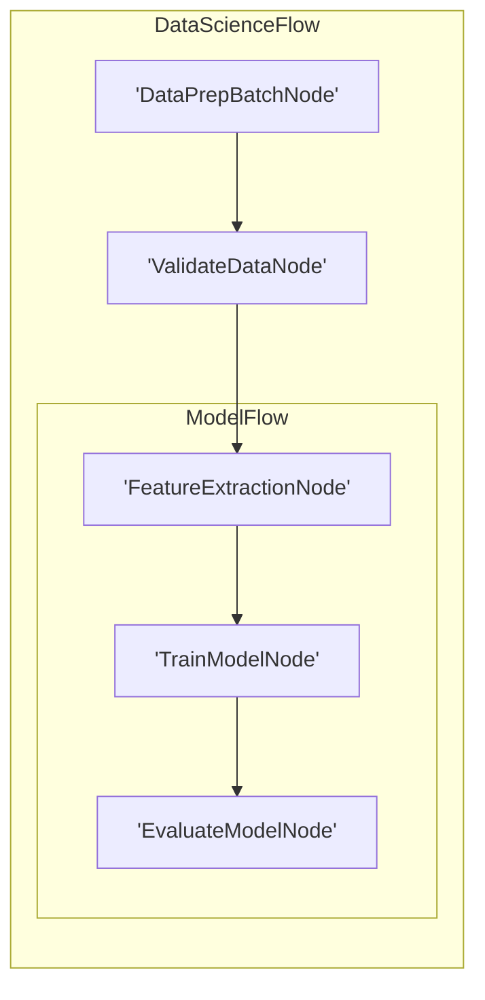

# Visualization and Debugging

Similar to LLM wrappers, we **don't** provide built-in visualization and debugging. Here, we recommend some *minimal* (and incomplete) implementations These examples can serve as a starting point for your own tooling.

## 1. Visualization with Mermaid

This code recursively traverses the nested graph, assigns unique IDs to each node, and treats Flow nodes as subgraphs to generate Mermaid syntax for a hierarchical visualization.


```python
def build_mermaid(start):
    ids, visited, lines = {}, set(), ["graph LR"]
    ctr = 1
    def get_id(n):
        nonlocal ctr
        return ids[n] if n in ids else (ids.setdefault(n, f"N{ctr}"), (ctr := ctr + 1))[0]
    def link(a, b):
        lines.append(f"    {a} --> {b}")
    def walk(node, parent=None):
        if node in visited:
            return parent and link(parent, get_id(node))
        visited.add(node)
        if isinstance(node, Flow):
            node.start_node and parent and link(parent, get_id(node.start_node))
            lines.append(f"\n    subgraph sub_flow_{get_id(node)}[{type(node).__name__}]")
            node.start_node and walk(node.start_node)
            for nxt in node.successors.values():
                node.start_node and walk(nxt, get_id(node.start_node)) or (parent and link(parent, get_id(nxt))) or walk(nxt)
            lines.append("    end\n")
        else:
            lines.append(f"    {(nid := get_id(node))}['{type(node).__name__}']")
            parent and link(parent, nid)
            [walk(nxt, nid) for nxt in node.successors.values()]
    walk(start)
    return "\n".join(lines)
```



For example, suppose we have a complex Flow for data science:

```python
class DataPrepBatchNode(BatchNode):
    def prep(self,shared): return []
class ValidateDataNode(Node): pass
class FeatureExtractionNode(Node): pass
class TrainModelNode(Node): pass
class EvaluateModelNode(Node): pass
class ModelFlow(Flow): pass
class DataScienceFlow(Flow):pass

feature_node = FeatureExtractionNode()
train_node = TrainModelNode()
evaluate_node = EvaluateModelNode()
feature_node >> train_node >> evaluate_node
model_flow = ModelFlow(start=feature_node)
data_prep_node = DataPrepBatchNode()
validate_node = ValidateDataNode()
data_prep_node >> validate_node >> model_flow
data_science_flow = DataScienceFlow(start=data_prep_node)
result = build_mermaid(start=data_science_flow)
```

The code generates a Mermaid diagram:



## 2. Interactive D3.js Visualization

For more complex flows, a static diagram may not be sufficient. We provide a D3.js-based interactive visualization that allows for dragging nodes, showing group boundaries for flows, and connecting flows at their boundaries.

### Converting Flow to JSON

First, we convert the PocketFlow graph to JSON format suitable for D3.js:

```python
def flow_to_json(start):
    """Convert a flow to JSON format suitable for D3.js visualization.
    
    This function walks through the flow graph and builds a structure with:
    - nodes: All non-Flow nodes with their group memberships
    - links: Connections between nodes within the same group
    - group_links: Connections between different groups (for inter-flow connections)
    - flows: Flow information for group labeling
    """
    nodes = []
    links = []
    group_links = []  # For connections between groups (Flow to Flow)
    ids = {}
    node_types = {}
    flow_nodes = {}  # Keep track of flow nodes
    ctr = 1

    def get_id(n):
        nonlocal ctr
        if n not in ids:
            ids[n] = ctr
            node_types[ctr] = type(n).__name__
            if isinstance(n, Flow):
                flow_nodes[ctr] = n  # Store flow reference
            ctr += 1
        return ids[n]

    def walk(node, parent=None, group=None, parent_group=None, action=None):
        # Traverse the flow graph recursively
        # ...implementation details...

    # Start the traversal
    walk(start)

    # Post-processing: Generate group links based on node connections between different groups
    node_groups = {n["id"]: n["group"] for n in nodes}
    filtered_links = []
    
    for link in links:
        source_id = link["source"]
        target_id = link["target"]
        source_group = node_groups.get(source_id, 0)
        target_group = node_groups.get(target_id, 0)
        
        # If source and target are in different groups and both groups are valid
        if source_group != target_group and source_group > 0 and target_group > 0:
            # Add to group links if not already there
            # Skip adding this link to filtered_links - we don't want direct node connections across groups
        else:
            # Keep links within the same group
            filtered_links.append(link)
    
    return {
        "nodes": nodes,
        "links": filtered_links,  # Use filtered links instead of all links
        "group_links": group_links,
        "flows": {str(k): v.__class__.__name__ for k, v in flow_nodes.items()},
    }
```

### Creating the Visualization

Then, we generate an HTML file with D3.js visualization:

```python
def create_d3_visualization(json_data, output_dir="./viz", filename="flow_viz"):
    """Create a D3.js visualization from JSON data.
    
    This generates an HTML file with an interactive visualization where:
    - Nodes are represented as circles
    - Flows are shown as dashed rectangles (groups)
    - Inter-group connections are shown as dashed lines connecting at group boundaries
    - Node and group labels are displayed
    - Nodes can be dragged to reorganize the layout
    """
    # Create output directory
    os.makedirs(output_dir, exist_ok=True)
    
    # Save JSON data to file
    json_path = os.path.join(output_dir, f"{filename}.json")
    with open(json_path, "w") as f:
        json.dump(json_data, f, indent=2)
    
    # Generate HTML with D3.js visualization
    # ...HTML template with D3.js code...
    
    # Write HTML to file
    html_path = os.path.join(output_dir, f"{filename}.html")
    with open(html_path, "w") as f:
        f.write(html_content)
    
    print(f"Visualization created at {html_path}")
    return html_path
```

### Convenience Function

A convenience function to visualize flows:

```python
def visualize_flow(flow, flow_name):
    """Helper function to visualize a flow with both mermaid and D3.js"""
    print(f"\n--- {flow_name} Mermaid Diagram ---")
    print(build_mermaid(start=flow))

    print(f"\n--- {flow_name} D3.js Visualization ---")
    json_data = flow_to_json(flow)
    create_d3_visualization(
        json_data, filename=f"{flow_name.lower().replace(' ', '_')}"
    )
```

### Usage Example

```python
from visualize import visualize_flow

# Create a complex flow with nested subflows
# ...flow definition...

# Generate visualization
visualize_flow(data_science_flow, "Data Science Flow")
```

This generates:
1. A mermaid diagram in the console
2. A JSON file with the flow structure
3. An HTML file with the interactive D3.js visualization

The D3.js visualization offers several advantages:
- **Interactivity**: Nodes can be dragged to reorganize the layout
- **Group visualization**: Flows are shown as groups with their own boundaries
- **Inter-group connections**: Links between groups connect at boundaries for cleaner visualization
- **Action labels**: Edge labels show transition actions

## 3. Call Stack Debugging

It would be useful to print the Node call stacks for debugging. This can be achieved by inspecting the runtime call stack:

```python
import inspect

def get_node_call_stack():
    stack = inspect.stack()
    node_names = []
    seen_ids = set()
    for frame_info in stack[1:]:
        local_vars = frame_info.frame.f_locals
        if 'self' in local_vars:
            caller_self = local_vars['self']
            if isinstance(caller_self, BaseNode) and id(caller_self) not in seen_ids:
                seen_ids.add(id(caller_self))
                node_names.append(type(caller_self).__name__)
    return node_names
```

For example, suppose we have a complex Flow for data science:

```python
class DataPrepBatchNode(BatchNode): 
    def prep(self, shared): return []
class ValidateDataNode(Node): pass
class FeatureExtractionNode(Node): pass
class TrainModelNode(Node): pass
class EvaluateModelNode(Node): 
    def prep(self, shared):
        stack = get_node_call_stack()
        print("Call stack:", stack)
class ModelFlow(Flow): pass
class DataScienceFlow(Flow):pass

feature_node = FeatureExtractionNode()
train_node = TrainModelNode()
evaluate_node = EvaluateModelNode()
feature_node >> train_node >> evaluate_node
model_flow = ModelFlow(start=feature_node)
data_prep_node = DataPrepBatchNode()
validate_node = ValidateDataNode()
data_prep_node >> validate_node >> model_flow
data_science_flow = DataScienceFlow(start=data_prep_node)
data_science_flow.run({})
```

The output would be: `Call stack: ['EvaluateModelNode', 'ModelFlow', 'DataScienceFlow']`