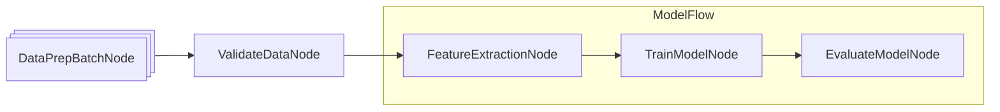

# Visualization

Visualizing the flow and node structure can greatly help understanding. While we do **not** include built-in visualization tools, we provide an example of how to create one using **Mermaid**.

### Example: Visualization of Node with Mermaid


```python
# Generate Mermaid diagram code for a Flow or Node structure
def build_mermaid(start):
    node_ids, visited = {}, set()
    lines = ["graph LR"]
    counter = [1]  # Counter for unique node IDs

    def get_id(node):
        if node not in node_ids:
            node_ids[node] = f"N{counter[0]}"
            counter[0] += 1
        return node_ids[node]

    def connect(src, tgt):
        lines.append(f"    {src} --> {tgt}")

    def walk(node, parent_id=None):
        if node in visited:
            if parent_id:
                connect(parent_id, get_id(node))
            return
        visited.add(node)

        if isinstance(node, Flow):
            # Handle Flow nodes
            if parent_id and node.start:
                connect(parent_id, get_id(node.start))

            lines.append(f"\n    subgraph sub_flow_{get_id(node)}[{type(node).__name__}]")

            if node.start:
                walk(node.start)

            for succ_node in node.successors.values():
                if node.start:
                    walk(succ_node, get_id(node.start))
                else:
                    if parent_id:
                        connect(parent_id, get_id(succ_node))
                    walk(succ_node)

            lines.append("    end\n")

        else:
            # Handle simple Nodes
            curr_id = get_id(node)
            if isinstance(node, BatchNode):
                label = f'{curr_id}@{{shape: procs, label: "{type(node).__name__}"}}'
            else:
                label = f'{curr_id}@{{label: "{type(node).__name__}"}}'

            if parent_id:
                lines.append(f"    {label}")
                connect(parent_id, curr_id)
            else:
                lines.append(f"    {label}")

            for succ_node in node.successors.values():
                walk(succ_node, curr_id)

    walk(start)
    return "\n".join(lines)
```


### Usage Example

Here, we define some example Nodes and Flows to generate a Mermaid diagram:

```python
class DataPrepBatchNode(BatchNode):
    pass

class ValidateDataNode(Node):
    pass

class FeatureExtractionNode(Node):
    pass

class TrainModelNode(Node):
    pass

class EvaluateModelNode(Node):
    pass

class ModelFlow(Flow):
    pass

feature_node = FeatureExtractionNode()
train_node = TrainModelNode()
evaluate_node = EvaluateModelNode()
feature_node >> train_node >> evaluate_node
model_flow = ModelFlow(start=feature_node)

data_prep_node = DataPrepBatchNode()
validate_node = ValidateDataNode()
data_prep_node >> validate_node >> model_flow
build_mermaid(start=data_prep_node)
```

The above code produces a Mermaid diagram (e.g., use the [Mermaid Live Editor](https://mermaid.live/) to render it):


